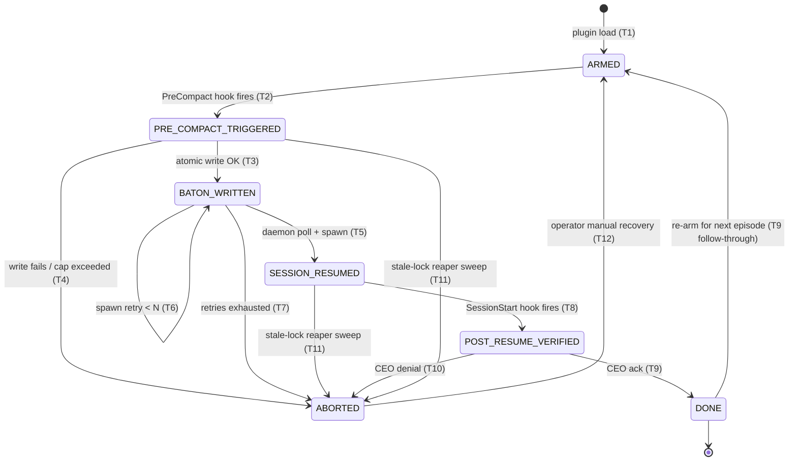

# Auto-Resume Daemon — Design

**Status**: Stage 2 SKELETON (T-2-1 keystone). Section bodies authored by T-2-2..T-2-6 EXECUTING dispatches; integration sweep by T-2-7.

**Owner**: PO-PM (skeleton + cross-cutting §4/§5/§6) + RD-PM (§1/§2/§3 bodies).

**Branch**: `feat/v0.1.7-auto-resume-daemon`.

**Charter goal**: Plugin-self-contained AutoCompact resilience — Claude Code sessions survive AutoCompact / cross-session boundaries without losing work, with CEO intervening only at gates.

> **Selection rationale**: Stage 2 plan = Plan B (Skeleton-first by-domain parallel) per CCBL-003 (CCB-Light override of Opus PlanAudit `selected_id=A`). See `PROGRESS.md` ## CCB Activity for full ADR-style record. Override rationale: cross-section interface freezing (frozen-decisions table + cross-reference graph) mitigates the 1 MB / 16 MB drift case study and enables organic PM allocation across §1-§3 (RD) + §4-§6 (PO).

---

## Stage 1 evidence cross-reference

This table maps Stage 1 RAID findings to design implications and the section(s) where each finding is consumed. T-2-2..T-2-6 EXECUTING tasks MUST cite these RAID IDs inline in their respective sections.

| Stage 1 finding | Design implication | Used in section(s) |
|---|---|---|
| A-001 VALIDATED (`claude --resume <id> -p`) | Resume CLI primitive available; payload IS new turn input | §1 (`SESSION_RESUMED` state), §4 (plist Resume command), §5 (prompt-injection threat surface) |
| A-002 VALIDATED (`$CLAUDE_PROJECT_DIR/.teamlead/` writable) | Baton + gate.lock filesystem location outside `CLAUDE_PLUGIN_ROOT` | §2 (baton path), §3 (gate.lock path) |
| A-003 CLOSED design-irrelevant (per CCBL-001) | Hook payload channel = disk-write default (NOT stdout) | §2 (write protocol), §5 (channel-trust threat model) |
| I-014 STRUCTURAL (`--print` mode = no PreCompact fire) | Resumed session in `-p` mode is hook-free zone | §1 (state-machine assumes hook fire only in interactive mode), §4 (daemon must not assume PreCompact will fire post-resume) |
| I-015 STRUCTURAL (`--print` mode = no Stop fire) | Cannot rely on Stop hook to signal resume completion | §1 (terminal-state actor must be SessionStart hook or external observer) |
| I-018 LOW (`pretooluse_guard.py` blocks `chmod`/`rm`/Write-outside-project) | Hook scripts must use Python (not bash) for filesystem ops; install path needs guard-tolerant probe-and-fall-back | §4 (install procedure), §6 (env-portability fallbacks) |
| R-001 MITIGATED monitor-only (no Anthropic native daemon) | We own the auto-resume design end-to-end; no upstream API to lean on | §1 (full lifecycle), §5 (threat model — no platform trust boundary) |
| R-002 OPEN (Stage 4 launchd install requires guard-tolerant probe) | Install must not hard-fail on guard-protected hosts | §4 (install layers), §6 (probe-and-fall-back contract) |
| FV-T-1-7 (timeout = hard kill; ≤ 16 MB observed-no-truncation) | Atomic write required; baton size cap chosen for round-trip cost, not hook limit | §2 (atomic write + size cap), §3 (TTL ≥ baton write timeout) |
| I-001 OPEN (silent auto-resume failure cost) | CEO notification path required; non-Auto-Mode default | §5 (mitigation), §1 (`POST_RESUME_VERIFIED` checkpoint) |

---

## Frozen design decisions (per CCBL-003 + Stage 1 evidence)

These decisions are CLOSED at Stage 2 PLANNING. Subsequent EXECUTING tasks (T-2-2..T-2-6) MUST NOT renegotiate these without raising a CCB-Light. Cross-section drift case study (1 MB vs 16 MB baton cap divergence) is resolved here.

| Decision | Value | Rationale | Source |
|---|---|---|---|
| Baton size limit | **≤ 1 MB chosen design cap** (NOT 16 MB) | Round-trip cost + log-noise; 16 MB is observed-no-truncation upper bound only, NOT the chosen cap | FV-T-1-7 line 587 (chosen) vs line 580 (observed ceiling) |
| Hook payload channel | Disk-write (NOT stdout) | Safer pattern; consistent with FV-T-1-2 implication; CCBL-001 closed A-003 design-irrelevant | CCBL-001 |
| Baton + gate.lock location | `$CLAUDE_PROJECT_DIR/.teamlead/` | Outside `CLAUDE_PLUGIN_ROOT`; per-project isolation; A-002 validated writable | A-002 (Stage 1) |
| Auto-Mode default for resumed sessions | OFF (interactive default) | `~/CLAUDE.md` §高風險操作 discipline; resumed session must not silently auto-execute | Charter constraint + I-001 mitigation |
| Plan decomposition strategy (Stage 2) | Skeleton-first by-domain parallel (Plan B) | Cross-section interface freezing + organic PM allocation; mitigates cross-section drift | CCBL-003 (Opus PlanAudit override) |

---

## §1 State Machine

### Scope and assumptions

This section defines the lifecycle of a single auto-resume episode: from a Claude Code interactive session being **ARMED** for AutoCompact survival, through PreCompact firing, baton write, daemon-driven session resume, post-resume verification, and the terminal disposition (`DONE` on success, `ABORTED` on any unrecoverable failure).

**Interactive-only track (v0.1.7 scope).** Per I-014 / I-015 (T-1-2 + T-1-3 evidence: `--print` mode does not fire PreCompact or Stop hooks on claude 2.1.112), the entire state machine assumes the **prior session is interactive**. The resumed session is **also interactive by default** — the daemon resumes via `claude --resume <id>` (NOT `-p`), so PreCompact/Stop hooks remain available for subsequent re-arming. A headless `-p`-mode resume is explicitly out-of-scope (see [§Open question resolution](#open-question-resolution) Q4 below) and would be a parallel "headless" track in a future version.

**Hook-script-language constraint (I-018).** All state-changing actors that interact with the filesystem (PreCompact write, daemon read, SessionStart verify) are implemented in **Python**, not bash, because `pretooluse_guard.py` blocks `chmod` / `rm` / Write-outside-project on guard-protected hosts. Side-effects in the transition table below assume Python `os.replace()` for atomic write and Python `os.kill(pid, 0)` for liveness probe.

### State definitions

| State | Kind | Meaning |
|---|---|---|
| `ARMED` | entry | Plugin loaded; PreCompact hook registered; gate.lock initialized; baton dir present. Prior session running normally. |
| `PRE_COMPACT_TRIGGERED` | transient | PreCompact hook is firing; baton write in progress; gate.lock acquired by hook actor. |
| `BATON_WRITTEN` | persistent | Baton atomically written to `$CLAUDE_PROJECT_DIR/.teamlead/baton.json`; gate.lock released by hook; AutoCompact about to consume context. Survives session crash. |
| `SESSION_RESUMED` | transient | Daemon detected baton; invoked `claude --resume <session_id>`; new Claude process is spawning. |
| `POST_RESUME_VERIFIED` | checkpoint | SessionStart hook in resumed session re-loaded baton; CEO acknowledgement gate (interactive default per `~/CLAUDE.md` §高風險操作); awaiting human green-light. |
| `DONE` | terminal | CEO acked; baton consumed (renamed to `baton.consumed-<ts>.json`); state machine returns to `ARMED` for next episode. |
| `ABORTED` | terminal | Unrecoverable failure (timeout / corrupted baton / N-failed-relaunches / CEO denial). CEO notification dropped at `$CLAUDE_PROJECT_DIR/.teamlead/last-resume-failure.txt`. Operator-driven recovery only. |

### Transition table

Every transition cites its supporting Stage 1 evidence (RAID ID) or is explicitly flagged `[unverified — Stage 3 dogfood]`. Side-effects assume Python actors per I-018.

| # | Event | From state | To state | Actor | Side effect | Failure mode | Evidence |
|---|---|---|---|---|---|---|---|
| 1 | Plugin load (SessionStart, no baton present) | (entry) | `ARMED` | SessionStart hook | Ensure `.teamlead/` dir; verify gate.lock absent or stale-recoverable | Dir creation blocked by I-018 guard → log + degraded mode | A-002 (writable), I-018 (guard) |
| 2 | PreCompact hook fires | `ARMED` | `PRE_COMPACT_TRIGGERED` | PreCompact hook (Python) | Acquire gate.lock with `holder_role=PreCompact`, `state_token=ARMED→PRE_COMPACT_TRIGGERED` | Lock contention (daemon holds lock) → wait up to TTL then abort write | A-002, I-018; gate.lock semantics → §3 |
| 3 | Baton serialize + atomic write success | `PRE_COMPACT_TRIGGERED` | `BATON_WRITTEN` | PreCompact hook (Python) | `os.replace(baton.tmp, baton.json)`; release gate.lock; emit `gate_state=BATON_WRITTEN` in baton | Hook timeout (default 60 s; FV-T-1-7) → torn `baton.tmp` left on disk; gate.lock left held with stale TTL | A-001 (resume primitive viability), FV-T-1-7 (timeout = hard kill) |
| 4 | Baton write fails (disk full / payload > 1 MB cap / serialize error) | `PRE_COMPACT_TRIGGERED` | `ABORTED` | PreCompact hook (Python) | Release gate.lock; write diagnostic to `last-resume-failure.txt` (if writable); allow AutoCompact to proceed | If guard blocks failure-log write → silent abort; relies on next SessionStart to detect (`baton.json` absent + lock state inconsistent) | I-018, FV-T-1-7 (1 MB chosen cap; 16 MB observed) |
| 5 | Daemon poll detects fresh baton (`baton.json` mtime newer than last-seen) | `BATON_WRITTEN` | `SESSION_RESUMED` | Daemon (launchd-managed) | Read baton; verify `session_id` + `prior_pause_commit`; spawn `claude --resume <session_id>` (interactive, NOT `-p`) | Daemon not running (launchd boot failure / R-002 install path failed) → baton sits indefinitely; recovered when CEO next opens Claude (SessionStart fallback) | A-001 VALIDATED (`claude --resume <id>` works); R-002 OPEN (install fallback) |
| 6 | Daemon spawn fails (binary missing / permission / launchd reject) | `BATON_WRITTEN` | `BATON_WRITTEN` (retry) | Daemon | Increment retry counter in `.teamlead/daemon-retries`; back off exponentially | After N=3 retries → escalate to `ABORTED`; write `last-resume-failure.txt` with reason | A-001 (CLI), R-002 (install reliability); N=3 chosen per I-001 mitigation |
| 7 | Retry budget exhausted | `BATON_WRITTEN` | `ABORTED` | Daemon | Stop respawn loop; write CEO notification | If file-system write also fails → daemon `os.exit(1)`; launchd `KeepAlive=false` prevents respawn loop | I-001 (silent-failure cost); §4 plist `KeepAlive: SuccessfulExit: false` |
| 8 | Resumed session SessionStart hook fires; baton present | `SESSION_RESUMED` | `POST_RESUME_VERIFIED` | SessionStart hook (Python) | Read baton; load RAID + PROGRESS.md anchor; compose `restore_prompt`; HALT for CEO ack (Auto-Mode OFF per frozen decision) | I-014/I-015 hook-free-zone: if daemon **incorrectly** resumed via `-p` (off-spec), SessionStart never fires → episode hangs in `SESSION_RESUMED` until reaper sweeps | A-001 (interactive resume), I-014/I-015 (hook-free-zone in `-p`); frozen decision Auto-Mode-OFF |
| 9 | CEO ack (interactive resume command) | `POST_RESUME_VERIFIED` | `DONE` | SessionStart hook + CEO | Rename `baton.json` → `baton.consumed-<ISO>.json`; reset gate.lock; transition back to `ARMED` for next episode | CEO denies → transition to `ABORTED` (manual investigation) | `~/CLAUDE.md` §高風險操作 (CEO-gated); I-001 mitigation |
| 10 | CEO denial / explicit abort | `POST_RESUME_VERIFIED` | `ABORTED` | SessionStart hook + CEO | Move baton to `baton.rejected-<ISO>.json`; preserve git stash safety net (see §5); release gate.lock | None (terminal) | Charter constraint |
| 11 | Stale-lock reaper sweep (no transition fired in TTL window) | `PRE_COMPACT_TRIGGERED` or `SESSION_RESUMED` | `ABORTED` | Daemon (periodic) or next SessionStart | Detect: PID-not-alive (`os.kill(pid, 0)` raises) AND mtime > TTL; force-release gate.lock; quarantine baton if torn | If reaper itself crashes → operator runs `doctor` subcommand (§6) for manual recovery | I-003 race-ordering inconclusive `[unverified — Stage 3 dogfood re-validates]`; FV-T-1-7 (TTL ≥ baton write timeout) |
| 12 | Operator manual recovery from `ABORTED` | `ABORTED` | `ARMED` | CEO + plugin `doctor` | Inspect `last-resume-failure.txt`; clear baton + gate.lock; re-arm | None (operator-driven) | Charter |

### State diagram



### Failure / fallback paths per non-terminal state

For each non-terminal state, the question "what if the actor's trigger never fires?" is answered by an explicit reaper or escalation path:

- **`ARMED`** — No trigger ever fires (CEO never compacts, never closes session): no failure, this is the steady state. Plugin remains armed indefinitely.
- **`PRE_COMPACT_TRIGGERED`** — If the PreCompact hook is killed mid-write (60 s timeout per FV-T-1-7), gate.lock and `baton.tmp` may be left on disk. **Reaper**: T11 stale-lock sweep on next daemon poll OR next SessionStart hook. Threshold: PID-not-alive AND mtime > TTL (TTL ≥ 60 s baton write timeout per §3).
- **`BATON_WRITTEN`** — If daemon never picks up baton (daemon dead / launchd failed / R-002 install incomplete), baton sits on disk. **Reaper**: next interactive SessionStart hook detects fresh baton + no daemon-touched marker → CEO is presented with the baton manually; effectively degrades to "operator-driven resume". This is the **graceful fallback** for hosts where launchd install was blocked by I-018 guard.
- **`SESSION_RESUMED`** — If SessionStart hook never fires (e.g., daemon mistakenly used `-p`, or hook crashed), episode hangs. **Reaper**: T11 daemon-side timeout — daemon expects `gate_state=POST_RESUME_VERIFIED` within bounded window (default 5 min); on timeout → abort + CEO notification.
- **`POST_RESUME_VERIFIED`** — Awaiting CEO ack. **No reaper** — this is intentionally a hard halt per `~/CLAUDE.md` §高風險操作. If CEO never acks, baton remains; next SessionStart re-loads same baton (idempotent). Operator decides when to ack or deny.

### Open question resolution

The four open questions from the T-2-1 skeleton are resolved here:

- **Q1: `POST_RESUME_VERIFIED` hard halt vs soft halt?** **Resolved: HARD HALT.** Per `~/CLAUDE.md` §高風險操作 + frozen decision "Auto-Mode default for resumed sessions: OFF". Soft halt would require a pre-approved baton field (`auto_mode_resumed=true`) which would cross the v0.1.7 charter constraint. Soft halt is explicitly **out of scope for v0.1.7**; revisit in v0.1.8+ only with CCB-Light.
- **Q2: Race handling — daemon detects compact while prior Claude process still alive?** **Resolved: gate.lock arbitrates** (full semantics in §3). Daemon never spawns `claude --resume` while gate.lock is held by `PreCompact`. PreCompact hook releases lock only after atomic write completes (T3). If prior process is alive but unresponsive (rare hang), daemon waits for stale-lock TTL (≥ 60 s) before reaping. **`[unverified — race ordering inconclusive in synthetic Stage 1; T-1-3 evidence]` re-validated at Stage 3 dogfood with real interactive PreCompact + Stop sequence.**
- **Q3: Failure recovery threshold (N retries)?** **Resolved: N=3 with exponential backoff (1 s, 4 s, 16 s)** per T6/T7. After 3 failures, transition to `ABORTED` and write CEO notification. Rationale: bounded so `last-resume-failure.txt` appears within ~30 s of first attempt; CEO sees signal on next session-start. Notification channel finalized in §5.
- **Q4: Hook-free zone (I-014/I-015) — does state machine need a parallel headless track?** **Resolved: NO for v0.1.7.** Daemon MUST resume with `claude --resume <id>` (interactive), NOT `claude --resume <id> -p`. Headless `-p` resumed session would be a hook-free zone where SessionStart cannot fire → state machine cannot transition `SESSION_RESUMED` → `POST_RESUME_VERIFIED`. Headless track is a **future v0.1.8+ extension** and is RAID-I'd here (see RAID updates). The §4 plist Resume command in v0.1.7 omits `-p` deliberately.

### Touchpoints (preserved from skeleton)

- **Depends on**: §2 baton fields (`gate_state`, `session_id`, `prior_pause_commit`) drive transition decisions; §3 gate.lock acquire/release gates state changes (T2/T3/T11).
- **Depended-by**: §4 launchd plist invokes Resume command at T5; §5 security model adds non-Auto-Mode default at `POST_RESUME_VERIFIED` (T8) and CEO notification at `ABORTED` (T7/T10/T11); §6 env-portability constrains which actors fire which transitions on guard-protected hosts (I-018 affects T1/T3/T4/T11).

---

## §2 Baton Schema

### Data structure: baton.json fields

```text
baton.json = {
  session_id: string,
  prior_pause_commit: string (git sha),
  last_dispatch_id: string,
  raid_hash_digest: string (sha256 of normalized RAID),
  gate_state: enum (ARMED|PRE_COMPACT_TRIGGERED|BATON_WRITTEN|SESSION_RESUMED|...),
  schema_version: integer,
  written_at_iso: string (ISO-8601 UTC),
  payload_size_bytes: integer,
  branch: string,
  progress_md_anchor: string,
  restore_prompt: string,
  auto_mode_resumed: boolean (default false)
}
```

(T-2-3 EXECUTING expands: per-field type/required/meaning + atomic-write protocol + retention policy + concrete example.)

### Touchpoints

- **Depends on**: §3 gate.lock state token cross-reference; §1 state-machine state names map to `gate_state` enum.
- **Depended-by**: §1 transitions read/write baton fields; §4 plist Resume command reads `restore_prompt` + `session_id`; §5 security model treats `restore_prompt` as operator-trusted (not user-content-trusted) and inspects `auto_mode_resumed` flag.

### Frozen decision (in-section reference)

**Baton size limit = ≤ 1 MB chosen design cap.** Per FV-T-1-7 line 587 design recommendation, for round-trip cost + log-noise reasons. The 16 MB figure (FV-T-1-7 line 580) is the observed-no-truncation upper bound on macOS claude 2.1.112 — NOT the chosen design cap. T-2-3 EXECUTING elaborates rationale; the chosen 1 MB cap is FROZEN at this skeleton.

### Open questions

- ? Inline full PROGRESS.md vs anchor-and-read-disk? Trade-off: self-contained vs bloat.
- ? `restore_prompt` templated (assemble at restore time) vs pre-rendered (frozen at PreCompact time)? Pre-rendered is more deterministic; templated allows late-binding fixes.
- ? Schema-version forward-compatibility policy across plugin versions?
- ? Atomic-write protocol: write `<baton>.tmp` → `mv` (assumed) — how does daemon handle a torn file from a hook-timeout kill?

---

## §3 Gate Lock Schema

### Data structure: gate.lock fields

```text
gate.lock = {
  pid: integer,
  acquired_at: string (ISO-8601 UTC),
  holder_role: enum (PreCompact|Daemon|SessionStart),
  state_token: string (matches baton.gate_state at acquire time),
  ttl_seconds: integer (≥ baton write timeout)
}
```

(T-2-4 EXECUTING expands: acquire/release protocol + stale-lock detection + idempotency contract + corrupt-lock recovery.)

### Touchpoints

- **Depends on**: §2 baton `gate_state` (lock state_token must match baton field at acquire); §1 state-machine names valid `holder_role` actors.
- **Depended-by**: §1 transitions require holding lock during state changes; §4 daemon respects lock semantics (no relaunch attempt while lock held by alive PID); §5 corrupt-lock recovery is a security-sensitive path (gate.lock.bak escalation).

### Open questions

- ? POSIX `flock(2)` (advisory, fast) vs `O_EXCL` create-then-write (portable, hook-fd-friendly)? Recommend split: `flock` for daemon, `O_EXCL` for hooks.
- ? Staleness threshold formula — PID-not-alive AND mtime > N min? What N? (TTL must be ≥ baton write timeout per FV-T-1-7.)
- ? SessionStart hook on resume-detect: read-only inspection or full lock acquire? Read-only is simpler; lock-acquire prevents double-resume races.
- ? I-009 flock-bug Stage 1 finding (parked) — does this affect macOS 14.x? Defer to T-2-4 EXECUTING.

---

## §4 Launchd Plist Template

### Data structure: plist label + path placeholders

```text
plist = {
  Label: 'com.teamwork-leader.auto-resume-daemon',
  ProgramArguments: ['${CLAUDE_PLUGIN_ROOT}/scripts/daemon.py', '--watch', '${CLAUDE_PROJECT_DIR}/.teamlead/'],
  RunAtLoad: true,
  KeepAlive: { SuccessfulExit: false },
  WorkingDirectory: '${CLAUDE_PROJECT_DIR}',
  StandardOutPath: '${CLAUDE_PROJECT_DIR}/.teamlead/daemon.out',
  StandardErrorPath: '${CLAUDE_PROJECT_DIR}/.teamlead/daemon.err'
}
```

(T-2-5 EXECUTING expands: full plist XML + install procedure (auto via `launchctl bootstrap` + manual README fallback per R-002) + uninstall procedure + interpolation contract.)

### Touchpoints

- **Depends on**: §1 state-machine `SESSION_RESUMED` transition (daemon invokes Resume command); §3 gate.lock semantics (daemon checks lock before relaunch); §6 env-portability probe-and-fall-back at install time (guard-tolerant).
- **Depended-by**: §5 security model (daemon hijack threat surface — wrong session resumed); §6 install-time fallbacks consume the manual README path defined here.

### Open questions

- ? Daemon detect AutoCompact via filesystem signal (baton.json mtime) or stdout/log stream attach? Filesystem-only is portable.
- ? `KeepAlive: SuccessfulExit: false` (only restart on crash) vs unconditional?
- ? FV-T-1-5 verdict pending — does install require Full Disk Access prompt? UX impact on plugin-driven install vs always-manual?
- ? Label collision-avoidance — is `com.teamwork-leader.*` unique enough? Should plugin-version suffix be added?

---

## §5 Security Model

### Data structure: threat-model row sketch

```text
threats = [
  { id: 'T-S-1', name: 'baton tampering by malicious local process', mitigation: '0600 perms + optional HMAC' },
  { id: 'T-S-2', name: 'prompt-injection via PROGRESS.md content reflected into restore_prompt', mitigation: 'plain-text allowlist + operator-trust posture' },
  { id: 'T-S-3', name: 'daemon hijack (wrong Claude session resumed)', mitigation: 'session_id + prior_pause_commit double-check' },
  { id: 'T-S-4', name: 'silent auto-resume drift (I-001)', mitigation: 'CEO notification path + step_review_mandatory' }
]
```

(T-2-6 EXECUTING expands: full threat model + git stash safety net flow + CEO notification channel + non-Auto-Mode default enforcement.)

### Touchpoints

- **Depends on**: §2 baton fields (`auto_mode_resumed`, `restore_prompt`, `prior_pause_commit`) drive threat surface; §1 `POST_RESUME_VERIFIED` is the security checkpoint; §3 corrupt-lock recovery is security-sensitive; §4 daemon-hijack mitigation reads §4 plist label trust boundary.
- **Depended-by**: §6 env-portability inherits Auto-Mode-OFF default as a portability invariant.

### Open questions

- ? HMAC/sign baton vs filesystem 0600 perms only — sufficient for v0.1.7 threat model?
- ? Git stash naming convention — encode session_id + timestamp; how to avoid race with operator's active commits?
- ? CEO notification channel — terminal print on next interactive session start? Persistent `.teamlead/last-resume-failure.txt`? launchd LaunchEvents user notification?
- ? Prompt-injection allowlist for `restore_prompt` — markdown allowed? hyperlinks? Recommend plain-text + strict char allowlist for v0.1.7.

---

## §6 Environment Portability

### Data structure: probe-and-fall-back tool matrix

```text
tool_matrix = {
  launchctl: { fallback: 'manual README install steps' },
  flock: { fallback: 'O_EXCL create-then-write (hook path)' },
  python3: { fallback: 'hard requirement; doctor subcommand reports missing' },
  gdate: { fallback: 'BSD date with portable format string' },
  chmod: { fallback: 'python os.chmod (per I-018 guard block)' }
}
```

(T-2-5 EXECUTING expands: full probe-and-fall-back algorithm per install-time op + tool-availability matrix + test plan.)

### Touchpoints

- **Depends on**: §4 install procedure (probe-and-fall-back is invoked at install time); §5 Auto-Mode-OFF default is a portability invariant inherited here.
- **Depended-by**: Cross-cutting — all sections must respect: hook scripts use Python (not bash) per I-018; all paths via `${CLAUDE_PLUGIN_ROOT}` / `${CLAUDE_PROJECT_DIR}` / `$HOME`; no hardcoded user paths.

### Open questions

- ? Plugin ship a `doctor` subcommand auditing host environment readiness pre-install? Recommend yes — reports missing-tool list.
- ? Linux support — out of scope (launchd is macOS-only) or in-scope via systemd-user-units? Recommend out-of-scope for v0.1.7.
- ? Windows support — explicit non-goal documented here.
- ? Test plan: install dry-run on guard-protected host (this repo) AND clean host (CI macOS runner) at Stage 4 close — who owns running both?

---

## Open questions deferred to EXECUTING

These questions are OUT-OF-SCOPE for T-2-1 skeleton. T-2-2..T-2-6 EXECUTING tasks resolve them in their respective sections (or carry as RAID-A/RAID-I at handback with explicit reason design can proceed without resolution).

### From Stage 1 RAID

- A-004: Pure-local synthetic for ALL Stage 1 tasks — backup plan; revisit only if Plan B fails.
- A-005: Real-session dogfood for T-1-2/T-1-3 — backup plan archived.
- A-008/A-009: Stage 2 backup plans archived from PLAN_AUDIT.
- I-005: Stage 1 abort procedure — Stage 2 design doc footnote needed (resolve in §1 or §5).
- I-006: Gate_1 reviewer role definition — Stage 2 close CCB-Light if not resolved by §5.
- I-007: Audit-trail `dod_status` aggregation — Stage 2 close CCB-Light.
- I-016/I-017: PO normalize touchpoint at Stage 2 close — resolved at T-2-7 integration.

### From Stage 2 PLAN_AUDIT (CCBL-003 deferred items)

- I-022: `selector_score` formula calibration (Phase 3) — Stage 2 close CCB-Light.
- A-006: Length estimate assumption (580-810 lines) — verify at T-2-7 integration sweep.

### Cross-section drift watchlist (resolved here, monitor in T-2-2..T-2-6)

- Baton size cap (1 MB chosen vs 16 MB observed) — FROZEN above; T-2-3 elaborates rationale only, does NOT renegotiate value.
- Hook payload channel (disk-write vs stdout) — FROZEN above per CCBL-001.
- Baton/gate.lock location (`$CLAUDE_PROJECT_DIR/.teamlead/`) — FROZEN above per A-002.

---

**End of skeleton.** Body authoring delegated to T-2-2..T-2-6 per Plan B parallel batch. T-2-7 integration sweep verifies cross-references resolve and total length ≥ 500 lines per tightened DoD.
