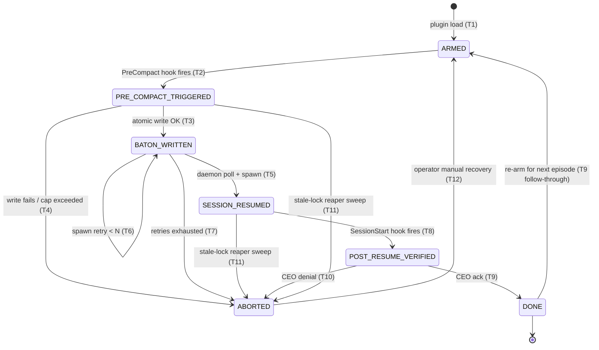

# Auto-Resume Daemon — Design

**Status**: Stage 2 SKELETON (T-2-1 keystone). Section bodies authored by T-2-2..T-2-6 EXECUTING dispatches; integration sweep by T-2-7.

**Owner**: PO-PM (skeleton + cross-cutting §4/§5/§6) + RD-PM (§1/§2/§3 bodies).

**Branch**: `feat/v0.1.7-auto-resume-daemon`.

**Charter goal**: Plugin-self-contained AutoCompact resilience — Claude Code sessions survive AutoCompact / cross-session boundaries without losing work, with CEO intervening only at gates.

> **Selection rationale**: Stage 2 plan = Plan B (Skeleton-first by-domain parallel) per CCBL-003 (CCB-Light override of Opus PlanAudit `selected_id=A`). See `PROGRESS.md` ## CCB Activity for full ADR-style record. Override rationale: cross-section interface freezing (frozen-decisions table + cross-reference graph) mitigates the 1 MB / 16 MB drift case study and enables organic PM allocation across §1-§3 (RD) + §4-§6 (PO).

---

## Stage 1 evidence cross-reference

This table maps Stage 1 RAID findings to design implications and the section(s) where each finding is consumed. T-2-2..T-2-6 EXECUTING tasks MUST cite these RAID IDs inline in their respective sections.

| Stage 1 finding | Design implication | Used in section(s) |
|---|---|---|
| A-001 VALIDATED (`claude --resume <id> -p`) | Resume CLI primitive available; payload IS new turn input | §1 (`SESSION_RESUMED` state), §4 (plist Resume command), §5 (prompt-injection threat surface) |
| A-002 VALIDATED (`$CLAUDE_PROJECT_DIR/.teamlead/` writable) | Baton + gate.lock filesystem location outside `CLAUDE_PLUGIN_ROOT` | §2 (baton path), §3 (gate.lock path) |
| A-003 CLOSED design-irrelevant (per CCBL-001) | Hook payload channel = disk-write default (NOT stdout) | §2 (write protocol), §5 (channel-trust threat model) |
| I-014 STRUCTURAL (`--print` mode = no PreCompact fire) | Resumed session in `-p` mode is hook-free zone | §1 (state-machine assumes hook fire only in interactive mode), §4 (daemon must not assume PreCompact will fire post-resume) |
| I-015 STRUCTURAL (`--print` mode = no Stop fire) | Cannot rely on Stop hook to signal resume completion | §1 (terminal-state actor must be SessionStart hook or external observer) |
| I-018 LOW (`pretooluse_guard.py` blocks `chmod`/`rm`/Write-outside-project) | Hook scripts must use Python (not bash) for filesystem ops; install path needs guard-tolerant probe-and-fall-back | §4 (install procedure), §6 (env-portability fallbacks) |
| R-001 MITIGATED monitor-only (no Anthropic native daemon) | We own the auto-resume design end-to-end; no upstream API to lean on | §1 (full lifecycle), §5 (threat model — no platform trust boundary) |
| R-002 OPEN (Stage 4 launchd install requires guard-tolerant probe) | Install must not hard-fail on guard-protected hosts | §4 (install layers), §6 (probe-and-fall-back contract) |
| FV-T-1-7 (timeout = hard kill; ≤ 16 MB observed-no-truncation) | Atomic write required; baton size cap chosen for round-trip cost, not hook limit | §2 (atomic write + size cap), §3 (TTL ≥ baton write timeout) |
| I-001 OPEN (silent auto-resume failure cost) | CEO notification path required; non-Auto-Mode default | §5 (mitigation), §1 (`POST_RESUME_VERIFIED` checkpoint) |

---

## Frozen design decisions (per CCBL-003 + Stage 1 evidence)

These decisions are CLOSED at Stage 2 PLANNING. Subsequent EXECUTING tasks (T-2-2..T-2-6) MUST NOT renegotiate these without raising a CCB-Light. Cross-section drift case study (1 MB vs 16 MB baton cap divergence) is resolved here.

| Decision | Value | Rationale | Source |
|---|---|---|---|
| Baton size limit | **≤ 1 MB chosen design cap** (NOT 16 MB) | Round-trip cost + log-noise; 16 MB is observed-no-truncation upper bound only, NOT the chosen cap | FV-T-1-7 line 587 (chosen) vs line 580 (observed ceiling) |
| Hook payload channel | Disk-write (NOT stdout) | Safer pattern; consistent with FV-T-1-2 implication; CCBL-001 closed A-003 design-irrelevant | CCBL-001 |
| Baton + gate.lock location | `$CLAUDE_PROJECT_DIR/.teamlead/` | Outside `CLAUDE_PLUGIN_ROOT`; per-project isolation; A-002 validated writable | A-002 (Stage 1) |
| Auto-Mode default for resumed sessions | OFF (interactive default) | `~/CLAUDE.md` §高風險操作 discipline; resumed session must not silently auto-execute | Charter constraint + I-001 mitigation |
| Plan decomposition strategy (Stage 2) | Skeleton-first by-domain parallel (Plan B) | Cross-section interface freezing + organic PM allocation; mitigates cross-section drift | CCBL-003 (Opus PlanAudit override) |

---

## §1 State Machine

### Scope and assumptions

This section defines the lifecycle of a single auto-resume episode: from a Claude Code interactive session being **ARMED** for AutoCompact survival, through PreCompact firing, baton write, daemon-driven session resume, post-resume verification, and the terminal disposition (`DONE` on success, `ABORTED` on any unrecoverable failure).

**Interactive-only track (v0.1.7 scope).** Per I-014 / I-015 (T-1-2 + T-1-3 evidence: `--print` mode does not fire PreCompact or Stop hooks on claude 2.1.112), the entire state machine assumes the **prior session is interactive**. The resumed session is **also interactive by default** — the daemon resumes via `claude --resume <id>` (NOT `-p`), so PreCompact/Stop hooks remain available for subsequent re-arming. A headless `-p`-mode resume is explicitly out-of-scope (see [§Open question resolution](#open-question-resolution) Q4 below) and would be a parallel "headless" track in a future version.

**Hook-script-language constraint (I-018).** All state-changing actors that interact with the filesystem (PreCompact write, daemon read, SessionStart verify) are implemented in **Python**, not bash, because `pretooluse_guard.py` blocks `chmod` / `rm` / Write-outside-project on guard-protected hosts. Side-effects in the transition table below assume Python `os.replace()` for atomic write and Python `os.kill(pid, 0)` for liveness probe.

### State definitions

| State | Kind | Meaning |
|---|---|---|
| `ARMED` | entry | Plugin loaded; PreCompact hook registered; gate.lock initialized; baton dir present. Prior session running normally. |
| `PRE_COMPACT_TRIGGERED` | transient | PreCompact hook is firing; baton write in progress; gate.lock acquired by hook actor. |
| `BATON_WRITTEN` | persistent | Baton atomically written to `$CLAUDE_PROJECT_DIR/.teamlead/baton.json`; gate.lock released by hook; AutoCompact about to consume context. Survives session crash. |
| `SESSION_RESUMED` | transient | Daemon detected baton; invoked `claude --resume <session_id>`; new Claude process is spawning. |
| `POST_RESUME_VERIFIED` | checkpoint | SessionStart hook in resumed session re-loaded baton; CEO acknowledgement gate (interactive default per `~/CLAUDE.md` §高風險操作); awaiting human green-light. |
| `DONE` | terminal | CEO acked; baton consumed (renamed to `baton.consumed-<ts>.json`); state machine returns to `ARMED` for next episode. |
| `ABORTED` | terminal | Unrecoverable failure (timeout / corrupted baton / N-failed-relaunches / CEO denial). CEO notification dropped at `$CLAUDE_PROJECT_DIR/.teamlead/last-resume-failure.txt`. Operator-driven recovery only. |

### Transition table

Every transition cites its supporting Stage 1 evidence (RAID ID) or is explicitly flagged `[unverified — Stage 3 dogfood]`. Side-effects assume Python actors per I-018.

| # | Event | From state | To state | Actor | Side effect | Failure mode | Evidence |
|---|---|---|---|---|---|---|---|
| 1 | Plugin load (SessionStart, no baton present) | (entry) | `ARMED` | SessionStart hook | Ensure `.teamlead/` dir; verify gate.lock absent or stale-recoverable | Dir creation blocked by I-018 guard → log + degraded mode | A-002 (writable), I-018 (guard) |
| 2 | PreCompact hook fires | `ARMED` | `PRE_COMPACT_TRIGGERED` | PreCompact hook (Python) | Acquire gate.lock with `holder_role=PreCompact`, `state_token=ARMED→PRE_COMPACT_TRIGGERED` | Lock contention (daemon holds lock) → wait up to TTL then abort write | A-002, I-018; gate.lock semantics → §3 |
| 3 | Baton serialize + atomic write success | `PRE_COMPACT_TRIGGERED` | `BATON_WRITTEN` | PreCompact hook (Python) | `os.replace(baton.tmp, baton.json)`; release gate.lock; emit `gate_state=BATON_WRITTEN` in baton | Hook timeout (default 60 s; FV-T-1-7) → torn `baton.tmp` left on disk; gate.lock left held with stale TTL | A-001 (resume primitive viability), FV-T-1-7 (timeout = hard kill) |
| 4 | Baton write fails (disk full / payload > 1 MB cap / serialize error) | `PRE_COMPACT_TRIGGERED` | `ABORTED` | PreCompact hook (Python) | Release gate.lock; write diagnostic to `last-resume-failure.txt` (if writable); allow AutoCompact to proceed | If guard blocks failure-log write → silent abort; relies on next SessionStart to detect (`baton.json` absent + lock state inconsistent) | I-018, FV-T-1-7 (1 MB chosen cap; 16 MB observed) |
| 5 | Daemon poll detects fresh baton (`baton.json` mtime newer than last-seen) | `BATON_WRITTEN` | `SESSION_RESUMED` | Daemon (launchd-managed) | Read baton; verify `session_id` + `prior_pause_commit`; spawn `claude --resume <session_id>` (interactive, NOT `-p`) | Daemon not running (launchd boot failure / R-002 install path failed) → baton sits indefinitely; recovered when CEO next opens Claude (SessionStart fallback) | A-001 VALIDATED (`claude --resume <id>` works); R-002 OPEN (install fallback) |
| 6 | Daemon spawn fails (binary missing / permission / launchd reject) | `BATON_WRITTEN` | `BATON_WRITTEN` (retry) | Daemon | Increment retry counter in `.teamlead/daemon-retries`; back off exponentially | After N=3 retries → escalate to `ABORTED`; write `last-resume-failure.txt` with reason | A-001 (CLI), R-002 (install reliability); N=3 chosen per I-001 mitigation |
| 7 | Retry budget exhausted | `BATON_WRITTEN` | `ABORTED` | Daemon | Stop respawn loop; write CEO notification | If file-system write also fails → daemon `os.exit(1)`; launchd `KeepAlive=false` prevents respawn loop | I-001 (silent-failure cost); §4 plist `KeepAlive: SuccessfulExit: false` |
| 8 | Resumed session SessionStart hook fires; baton present | `SESSION_RESUMED` | `POST_RESUME_VERIFIED` | SessionStart hook (Python) | Read baton; load RAID + PROGRESS.md anchor; compose `restore_prompt`; HALT for CEO ack (Auto-Mode OFF per frozen decision) | I-014/I-015 hook-free-zone: if daemon **incorrectly** resumed via `-p` (off-spec), SessionStart never fires → episode hangs in `SESSION_RESUMED` indefinitely until reaper sweeps; resumed session is open and idle on operator's terminal for up to 5 min before T11 daemon-side timeout fires — this is the exact I-001 silent-misroute risk scenario | A-001 (interactive resume), I-014/I-015 (hook-free-zone in `-p`); frozen decision Auto-Mode-OFF |
| 9 | CEO ack (interactive resume command) | `POST_RESUME_VERIFIED` | `DONE` | SessionStart hook + CEO | Rename `baton.json` → `baton.consumed-<ISO>.json`; reset gate.lock; transition back to `ARMED` for next episode | CEO denies → transition to `ABORTED` (manual investigation) | `~/CLAUDE.md` §高風險操作 (CEO-gated); I-001 mitigation |
| 10 | CEO denial / explicit abort | `POST_RESUME_VERIFIED` | `ABORTED` | SessionStart hook + CEO | Move baton to `baton.rejected-<ISO>.json`; preserve git stash safety net (see §5); release gate.lock | None (terminal) | Charter constraint |
| 11 | Stale-lock reaper sweep (no transition fired in TTL window) | `PRE_COMPACT_TRIGGERED` or `SESSION_RESUMED` | `ABORTED` | Daemon (periodic) or next SessionStart | Detect: PID-not-alive (`os.kill(pid, 0)` raises) AND mtime > TTL; force-release gate.lock; quarantine baton if torn | If reaper itself crashes → operator runs `doctor` subcommand (§6) for manual recovery | I-003 race-ordering inconclusive `[unverified — Stage 3 dogfood re-validates]`; FV-T-1-7 (TTL ≥ baton write timeout) |
| 12 | Operator manual recovery from `ABORTED` | `ABORTED` | `ARMED` | CEO + plugin `doctor` | Inspect `last-resume-failure.txt`; clear baton + gate.lock; re-arm | None (operator-driven) | Charter |

### State diagram


```mermaid
stateDiagram-v2
    [*] --> ARMED: plugin load (T1)

    ARMED --> PRE_COMPACT_TRIGGERED: PreCompact hook fires (T2)

    PRE_COMPACT_TRIGGERED --> BATON_WRITTEN: atomic write OK (T3)
    PRE_COMPACT_TRIGGERED --> ABORTED: write fails / cap exceeded (T4)

    BATON_WRITTEN --> SESSION_RESUMED: daemon poll + spawn (T5)
    BATON_WRITTEN --> BATON_WRITTEN: spawn retry < N (T6)
    BATON_WRITTEN --> ABORTED: retries exhausted (T7)

    SESSION_RESUMED --> POST_RESUME_VERIFIED: SessionStart hook fires (T8)
    SESSION_RESUMED --> ABORTED: stale-lock reaper sweep (T11)

    POST_RESUME_VERIFIED --> DONE: CEO ack (T9)
    POST_RESUME_VERIFIED --> ABORTED: CEO denial (T10)

    PRE_COMPACT_TRIGGERED --> ABORTED: stale-lock reaper sweep (T11)

    DONE --> ARMED: re-arm for next episode (T9 follow-through)

    ABORTED --> ARMED: operator manual recovery (T12)

    DONE --> [*]
```

### Failure / fallback paths per non-terminal state

For each non-terminal state, the question "what if the actor's trigger never fires?" is answered by an explicit reaper or escalation path:

- **`ARMED`** — No trigger ever fires (CEO never compacts, never closes session): no failure, this is the steady state. Plugin remains armed indefinitely.
- **`PRE_COMPACT_TRIGGERED`** — If the PreCompact hook is killed mid-write (60 s timeout per FV-T-1-7), gate.lock and `baton.tmp` may be left on disk. **Reaper**: T11 stale-lock sweep on next daemon poll OR next SessionStart hook. Threshold: PID-not-alive AND mtime > TTL (TTL ≥ 60 s baton write timeout per §3).
- **`BATON_WRITTEN`** — If daemon never picks up baton (daemon dead / launchd failed / R-002 install incomplete), baton sits on disk. **Reaper**: next interactive SessionStart hook detects fresh baton + no daemon-touched marker → CEO is presented with the baton manually; effectively degrades to "operator-driven resume". This is the **graceful fallback** for hosts where launchd install was blocked by I-018 guard.
- **`SESSION_RESUMED`** — If SessionStart hook never fires (e.g., daemon mistakenly used `-p`, or hook crashed), episode hangs. **Reaper**: T11 daemon-side timeout — daemon expects `gate_state=POST_RESUME_VERIFIED` within bounded window (default 5 min); on timeout → abort + CEO notification.
- **`POST_RESUME_VERIFIED`** — Awaiting CEO ack. **No reaper** — this is intentionally a hard halt per `~/CLAUDE.md` §高風險操作. If CEO never acks, baton remains; next SessionStart re-loads same baton (idempotent). Operator decides when to ack or deny.

### Open question resolution

The four open questions from the T-2-1 skeleton are resolved here:

- **Q1: `POST_RESUME_VERIFIED` hard halt vs soft halt?** **Resolved: HARD HALT.** Per `~/CLAUDE.md` §高風險操作 + frozen decision "Auto-Mode default for resumed sessions: OFF". Soft halt would require a pre-approved baton field (`auto_mode_resumed=true`) which would cross the v0.1.7 charter constraint. Soft halt is explicitly **out of scope for v0.1.7**; revisit in v0.1.8+ only with CCB-Light.
- **Q2: Race handling — daemon detects compact while prior Claude process still alive?** **Resolved: gate.lock arbitrates** (full semantics in §3). Daemon never spawns `claude --resume` while gate.lock is held by `PreCompact`. PreCompact hook releases lock only after atomic write completes (T3). If prior process is alive but unresponsive (rare hang), daemon waits for stale-lock TTL (≥ 60 s) before reaping. **`[unverified — race ordering inconclusive in synthetic Stage 1; T-1-3 evidence]` re-validated at Stage 3 dogfood with real interactive PreCompact + Stop sequence.**
- **Q3: Failure recovery threshold (N retries)?** **Resolved: N=3 with exponential backoff (1 s, 4 s, 16 s)** per T6/T7. After 3 failures, transition to `ABORTED` and write CEO notification. Rationale: bounded so `last-resume-failure.txt` appears within ~30 s of first attempt; CEO sees signal on next session-start. Notification channel finalized in §5.
- **Q4: Hook-free zone (I-014/I-015) — does state machine need a parallel headless track?** **Resolved: NO for v0.1.7.** Daemon MUST resume with `claude --resume <id>` (interactive), NOT `claude --resume <id> -p`. Headless `-p` resumed session would be a hook-free zone where SessionStart cannot fire → state machine cannot transition `SESSION_RESUMED` → `POST_RESUME_VERIFIED`. Headless track is a **future v0.1.8+ extension** and is RAID-I'd here (see RAID updates). The §4 plist Resume command in v0.1.7 omits `-p` deliberately.

### Touchpoints (preserved from skeleton)

- **Depends on**: §2 baton fields (`gate_state`, `session_id`, `prior_pause_commit`) drive transition decisions; §3 gate.lock acquire/release gates state changes (T2/T3/T11).
- **Depended-by**: §4 launchd plist invokes Resume command at T5; §5 security model adds non-Auto-Mode default at `POST_RESUME_VERIFIED` (T8) and CEO notification at `ABORTED` (T7/T10/T11); §6 env-portability constrains which actors fire which transitions on guard-protected hosts (I-018 affects T1/T3/T4/T11).

---

## §2 Baton Schema

### Scope and assumptions

This section defines the **baton.json** artifact: the on-disk handoff record that the PreCompact hook writes at `BATON_WRITTEN` (§1 T3) and that the daemon (T5) and the resumed-session SessionStart hook (T8/T9) consume to drive auto-resume. The baton is the single source of truth for cross-session continuity — every state transition in §1 that crosses the AutoCompact / session-restart boundary reads or writes this file.

The schema is intentionally **flat JSON with primitive-typed fields**: no nested objects, no arrays of objects, no binary payloads. This keeps the file (a) trivially diff-able for human inspection during `doctor` triage (§6), (b) cheap to serialize within the PreCompact hook's 60 s timeout budget (FV-T-1-7), and (c) compatible with the chosen 1 MB size cap (see "Size budget" below).

### File location and permissions

- **Path**: `$CLAUDE_PROJECT_DIR/.teamlead/baton.json` (per A-002 VALIDATED — plugin hooks CAN write outside `${CLAUDE_PLUGIN_ROOT}` to `$CLAUDE_PROJECT_DIR/.teamlead/`).
- **Permissions**: `0600` (owner read/write only) — consistent with §5 T-S-1 mitigation against baton tampering by malicious local process. The PreCompact hook MUST `os.chmod(baton.json, 0o600)` immediately after the atomic-rename step in T3, before releasing gate.lock.
- **Atomic-write protocol**: write to `baton.json.tmp` first, `os.replace(tmp, baton.json)` to commit (POSIX atomic rename on the same filesystem). Torn writes from a hook-timeout kill leave `baton.json.tmp` on disk; the next SessionStart or daemon poll quarantines the torn file (`baton.json.tmp.torn-<ISO>`) and treats the prior-good `baton.json` (if present) as authoritative — see §1 T11 stale-lock reaper.

### JSON schema fragment

The baton has **7 required fields** + **5 optional/extension fields**. Every required field MUST be present and non-null; the SessionStart hook treats absence as schema-version-mismatch and aborts to `ABORTED` (§1 T4 path generalized).

```json
{
  "session_id": "string (UUID, required) — Claude session UUID at pause time; drives `claude --resume <session_id>` (per A-001 VALIDATED). Mismatch with resumed session's actual ID at T8 → abort to ABORTED.",
  "prior_pause_commit": "string (git SHA-1 hex, required) — full 40-char git commit SHA at PreCompact-fire time. Resumed session SessionStart hook re-validates `git rev-parse HEAD` matches; mismatch indicates branch was force-pushed or moved during pause window — abort to ABORTED per §5 T-S-3.",
  "branch": "string (required) — git branch name at pause time. Resumed session re-validates `git rev-parse --abbrev-ref HEAD` matches; cross-branch resume is forbidden (per ~/.claude/rules/branch-discipline.md — staging/release branches must not host development work).",
  "last_action_iso": "string (ISO-8601 UTC, required) — timestamp of the most recent PROGRESS.md `Last Action` line at pause. Used by SessionStart hook to confirm the resumed session is reading the same PROGRESS.md the prior session left behind (drift indicator).",
  "progress_md_anchor": "string (sha256 hex, required) — sha256 digest of `PROGRESS.md` file content at pause. SessionStart hook recomputes; mismatch means PROGRESS.md was edited externally during pause — operator must reconcile before T9 ack.",
  "restore_prompt": "string (plain-text, required) — the prompt text injected via `claude --resume <id> -p \"<prompt>\"` per A-001 VALIDATED. Plain-text only; no markdown, no embedded shell, no template expansion at consume time. Treated as operator-trusted (not user-content-trusted) per §5 T-S-2.",
  "auto_mode_resumed": "boolean (required, default false) — when true, the resumed session may bypass the POST_RESUME_VERIFIED hard-halt (§1 T8) and proceed to auto-execute. Default value is `false` and is FROZEN per ~/CLAUDE.md §高風險操作 + §5 charter invariant. See `auto_mode_resumed: false` rationale below.",

  "last_dispatch_id": "string (optional) — TeamLead dispatch ID (e.g., S2-D4) currently in flight at pause; helps RAID reconciliation at resume.",
  "gate_state": "enum (optional) — one of {ARMED, PRE_COMPACT_TRIGGERED, BATON_WRITTEN, SESSION_RESUMED, POST_RESUME_VERIFIED, DONE, ABORTED}; mirrors §1 state machine. Set to BATON_WRITTEN at T3 commit; updated by daemon at T5 to SESSION_RESUMED.",
  "schema_version": "integer (optional, default 1) — baton schema version. Forward-compatibility policy: SessionStart hook accepts equal or lower version; higher version → schema-mismatch abort with operator-readable message.",
  "written_at_iso": "string (optional, ISO-8601 UTC) — timestamp of the atomic-rename commit at T3; distinct from `last_action_iso` (which tracks PROGRESS.md mtime).",
  "payload_size_bytes": "integer (optional) — self-reported size of the serialized baton at write time; cross-checked against `os.stat(baton.json).st_size` for tamper detection (§5 T-S-1)."
}
```

### Size budget

**Chosen design cap: ≤ 1 MB.** Per **FV-T-1-7 line 587** design recommendation: "Recommend Stage 2 baton schema cap at ≤ 1 MB for round-trip + log-noise reasons (not because of hook limits)". The cap is enforced at PreCompact-write time: if the serialized baton exceeds 1 MB, the hook aborts to `ABORTED` via §1 T4 (write-fails branch) rather than committing an oversized record.

**Observed-no-truncation ceiling: 16 MB** (FV-T-1-7 line 580 — "No payload truncation observed up to 16 MB on macOS with claude 2.1.112"). This figure is the empirically-measured upper bound where Claude Code's debug log captured the full `systemMessage` string verbatim. **The 16 MB figure is NOT the chosen design cap**; it is documented here only as the observed environmental ceiling. Treating 16 MB as the cap would risk log-noise saturation and round-trip latency well beyond what the AutoCompact resume flow tolerates.

The 1 MB chosen cap is FROZEN per Frozen Design Decisions table (top of doc) and per CCBL-003 cross-section drift resolution. T-2-3 elaborates rationale only; renegotiating the cap requires CCB-Light.

### `auto_mode_resumed: false` rationale

The `auto_mode_resumed` field defaults to `false` and is FROZEN at this default per `~/CLAUDE.md` §高風險操作 + the §5 frozen security invariant "Auto-Mode default for resumed sessions = OFF". The literal default `auto_mode_resumed: false` MUST appear in every PreCompact-written baton; the SessionStart hook (T8) treats any baton with `auto_mode_resumed != false` as suspect and routes through the same `POST_RESUME_VERIFIED` hard-halt CEO-ack path before honoring the flag.

Rationale: a resumed session that silently auto-executes would (a) bypass the §1 T8 → T9 CEO-ack gate, (b) cross the `~/CLAUDE.md` §高風險操作 boundary (no unattended high-risk ops), and (c) make I-001 silent-misroute failures invisible to the operator. Setting `auto_mode_resumed: false` as the schema default — and requiring an explicit baton-time decision to flip it — keeps the safe default unambiguous. Future `auto_mode_resumed: true` paths (if ever ratified) require CCB-Heavy + charter amendment, not a baton-author convention.

### Cross-reference to §1 state machine

| §1 transition | Baton interaction | Field(s) read/written |
|---|---|---|
| **T3** (`PRE_COMPACT_TRIGGERED` → `BATON_WRITTEN`) | PreCompact hook **writes** baton via atomic rename; sets `gate_state=BATON_WRITTEN` | All 7 required + optional fields populated; `written_at_iso`, `payload_size_bytes` set last |
| **T4** (`PRE_COMPACT_TRIGGERED` → `ABORTED`, write fails) | Hook **aborts** if serialize fails OR size > 1 MB cap; no baton committed | None written; `baton.json.tmp` may be left for T11 reaper to quarantine |
| **T5** (`BATON_WRITTEN` → `SESSION_RESUMED`) | Daemon **reads** baton; verifies `session_id` + `prior_pause_commit`; spawns `claude --resume <session_id>`; **updates** `gate_state=SESSION_RESUMED` | Reads: `session_id`, `prior_pause_commit`, `branch`, `restore_prompt`. Writes: `gate_state` only (in-place edit under gate.lock per §3) |
| **T8** (`SESSION_RESUMED` → `POST_RESUME_VERIFIED`) | SessionStart hook **reads** baton; recomputes `progress_md_anchor` + `git rev-parse HEAD`; matches against baton; HALTs for CEO ack (Auto-Mode-OFF default per `auto_mode_resumed: false` rationale above) | Reads all required fields; mismatch on any → `ABORTED` |
| **T9** (`POST_RESUME_VERIFIED` → `DONE`) | SessionStart hook + CEO ack **renames** `baton.json` → `baton.consumed-<ISO>.json`; resets gate.lock | None modified post-ack; baton becomes archival |

§3 gate.lock arbitrates cross-process coordination during T3 (PreCompact write) and T5 (daemon read+update); the baton file itself is **not** the synchronization primitive — gate.lock is. See §3 for acquire/release semantics.

### Concrete example

A representative baton at the moment of `BATON_WRITTEN` commit (T3), populated against a hypothetical mid-Stage-2 dispatch pause:

```json
{
  "session_id": "01J9ABCDXYZ-EXAMPLE-UUID-0001",
  "prior_pause_commit": "70c7f180abcdef0123456789abcdef0123456789",
  "branch": "feat/v0.1.7-auto-resume-daemon",
  "last_action_iso": "2026-05-03T14:32:18+08:00",
  "progress_md_anchor": "9e1c5a7b8d4f3e2a1b0c9d8e7f6a5b4c3d2e1f0a9b8c7d6e5f4a3b2c1d0e9f8a",
  "restore_prompt": "Resume Stage 2 EXECUTING wave 1: complete T-2-6 dispatch per S2-D5; PROGRESS.md anchor + RAID intact; last dispatch was T-2-3 PASS.",
  "auto_mode_resumed": false,
  "last_dispatch_id": "S2-D4",
  "gate_state": "BATON_WRITTEN",
  "schema_version": 1,
  "written_at_iso": "2026-05-03T14:32:20+08:00",
  "payload_size_bytes": 612
}
```

A torn write left by a hook-timeout kill would appear as `baton.json.tmp` (without the atomic rename). The reaper rule (§1 T11) detects this by combining "PID-not-alive" with "`baton.json.tmp` mtime > TTL" and quarantines to `baton.json.tmp.torn-<ISO>`; a prior-good `baton.json` (if present from an earlier successful T3) remains authoritative.

### Retention and consumption policy

- **Pre-consume**: `baton.json` is overwritten on each successful T3 (one baton per pause episode). The atomic rename guarantees readers never see a partial file.
- **Post-consume**: at T9 (CEO ack), the SessionStart hook renames `baton.json` → `baton.consumed-<ISO>.json`. Consumed batons accumulate in `.teamlead/` and serve as a forensic trail for `doctor` (§6) and post-mortem analysis. Pruning is operator-driven; no auto-cleanup in v0.1.7 (charter-deferred to v0.1.8+ if log volume becomes an operational concern).
- **Post-abort**: at T10 (CEO denial), `baton.json` → `baton.rejected-<ISO>.json`. Same retention semantics as consumed; flagged separately so `doctor` can surface explicit-rejection counts distinct from ack counts.

### Touchpoints

- **Depends on**: §3 gate.lock state token cross-reference (lock holder writes baton under lock); §1 state-machine state names map to `gate_state` enum values.
- **Depended-by**: §1 transitions T3/T4/T5/T8/T9 read/write baton fields per the cross-reference table above; §4 plist Resume command reads `restore_prompt` + `session_id`; §5 security model treats `restore_prompt` as operator-trusted (not user-content-trusted), inspects `auto_mode_resumed` flag, and validates `prior_pause_commit` for T-S-3 (daemon-hijack mitigation).

---

## §3 Gate Lock Schema

### Scope and assumptions

This section defines the **gate.lock** primitive: the cross-process coordination artifact that arbitrates who is allowed to mutate `baton.json` (§2) and the §1 state machine at any moment. The lock is paired with the baton — gate.lock holds the "who currently owns this episode" bit, while `baton.json` holds the persistent state. Together they let three independent actors (the PreCompact hook in the prior session, the launchd-managed daemon, and the SessionStart hook in the resumed session) coordinate without shared memory. Per I-018, all lock operations are implemented in **Python** (`os.open(O_CREAT|O_EXCL)` / `os.kill(pid, 0)` / `os.unlink`); shell `flock(1)` is rejected (see I-009 reference below).

### File location and permissions

- **Path**: `$CLAUDE_PROJECT_DIR/.teamlead/gate.lock` (per A-002 VALIDATED — same `.teamlead/` directory as `baton.json`; A-002 confirms hooks may write outside `${CLAUDE_PLUGIN_ROOT}` here).
- **Permissions**: `0600` (owner read/write only) — consistent with §2 baton perms and §5 T-S-1 mitigation. The lock holder MUST `os.chmod(gate.lock, 0o600)` immediately after the `O_CREAT|O_EXCL` open returns, before writing the JSON body. A world-readable lock would leak `PID` to other local UIDs and weaken the same-UID-trust posture.
- **Format**: JSON (consistent with `baton.json`), single object on disk; no trailing newline required but tolerated by the parser.

### Lock-file JSON schema

The lock has **3 required fields** + **2 optional/derived fields**. Required fields are present in every successfully-acquired lock; absence on parse → treat the lock as corrupt and route through stale-lock recovery (below).

```json
{
  "pid": "integer (required) — holder process ID at acquire time. Used by liveness probe `os.kill(pid, 0)` to detect dead-holder staleness; mismatch with `os.getpid()` of the would-be acquirer is the primary cross-process arbitration signal.",
  "acquired_at": "string (ISO-8601 UTC, required) — timestamp of the successful O_CREAT|O_EXCL open. Naming and format are identical to §2 baton's `written_at_iso` for cross-artifact diff-ability during `doctor` triage (§6).",
  "holder_role": "enum (required) — one of {PreCompact, Daemon, SessionStart}. Names the actor class that holds the lock; cross-checked against §1 transition table (T3 ⇒ PreCompact, T5 ⇒ Daemon, T8 ⇒ SessionStart). The §5 T-S-1 mitigation row uses `holder_role` to narrow the tamper window.",

  "state_token": "string (optional) — correlation token tying this lock to the baton's `gate_state` field at acquire time (§2 schema). When present, matches one of the §1 state names; mismatch on lock-release → log-only diagnostic (NOT abort) since the lock-release path is the authoritative state advance.",
  "ttl_seconds": "integer (optional, default 90) — absolute TTL value in seconds. Default `90` = 60 s baton write timeout (FV-T-1-7) + 30 s buffer for atomic-rename + `chmod` + lock release. Exposed as a field (rather than implicit constant) so `doctor` (§6) can surface the value during triage; never overridden in v0.1.7 hot path."
}
```

### Acquire / release semantics

**Acquire**: the would-be holder calls `fd = os.open(gate.lock, O_CREAT|O_EXCL|O_WRONLY, 0o600)`. The `O_EXCL` flag makes the create-or-fail atomic at the kernel level — no shell-quoting class of bugs (I-009). On success, the holder writes the JSON body, fsyncs, and closes the fd; the lock is now held. On `FileExistsError`:

1. Read the existing lock; parse `pid` and `acquired_at`.
2. Probe holder liveness: `os.kill(pid, 0)`.
   - Returns cleanly → holder alive → caller waits/retries per its own retry budget (PreCompact hook waits up to 30 s then aborts T3 → T4; daemon polls every 5 s; SessionStart waits up to 10 s).
   - Raises `ProcessLookupError` (ESRCH) → holder dead → invoke stale-lock recovery (below).
   - Raises `PermissionError` (EPERM) → holder alive but owned by another UID → treat as alive, log warning (same-UID-trust posture violated; surface in `doctor`).
3. If recovery succeeded, retry the `O_CREAT|O_EXCL` open once.

**Release**: the holder calls `os.unlink(gate.lock)` after the critical section completes. Atomic rename of `baton.json.tmp → baton.json` (§2 T3) MUST happen **before** the unlink, so a crash between rename and unlink leaves a recoverable state (good baton + stale lock → reaper handles). If the holding process dies mid-critical-section, the lock file is left on disk for the stale-lock reaper to clean up.

**Cross-reference to §1 transitions**: the lock interacts with three §1 transitions. **T3** (`PRE_COMPACT_TRIGGERED → BATON_WRITTEN`): PreCompact hook acquires with `holder_role=PreCompact` before writing `baton.json.tmp`, releases after the atomic rename completes. **T5** (`BATON_WRITTEN → SESSION_RESUMED`): the daemon acquires with `holder_role=Daemon` before spawning `claude --resume`, releases after the spawn returns (success → `gate_state=SESSION_RESUMED` written to baton; failure → §1 T6 retry path). **T11** (stale-lock reaper sweep): the reaper iterates all `.teamlead/gate.lock` instances, applies the staleness criteria below, and force-releases any that match. The reaper itself does NOT acquire the lock (it operates on dead holders only); see "Stale-lock recovery" below.

### Stale-lock recovery

A lock is **stale** if any of the following holds:

- **TTL expiry**: `now - acquired_at > ttl_seconds` (default 90 s; ≥ baton write timeout per FV-T-1-7 to ensure a legitimate slow PreCompact write is not misclassified as stale). Note: the 90 s TTL also provides an implicit safety net against PID recycling — a recycled PID that happens to map to a live unrelated process would pass the liveness probe, but the TTL ensures the lock is eventually reaped regardless; this is not an exhaustive defense against PID recycling, but it bounds the window to ~90 s.
- **Dead holder**: `os.kill(holder_pid, 0)` raises `ProcessLookupError` (ESRCH) — the recorded PID no longer exists in the process table.
- **Role/process mismatch**: `holder_role=Daemon` but the recorded PID does not match the launchd-supervised daemon's recorded PID (read from `.teamlead/daemon.pid`, written by `daemon.py` itself at process startup before polling — referenced by §4 ProgramArguments. NOTE: this PID file is NOT the plist `StandardOutPath` (which is daemon.out stdout log); daemon.py self-write of its own PID is a separate sidecar contract added in T-2-4 §3.). This catches a corrupted-lock case where a stale `holder_role` field outlived the actor class.

**Recovery action**: the stale-lock reaper (called from §1 T11) performs `os.unlink(gate.lock)` and then re-issues the original `O_CREAT|O_EXCL` open as the new holder. The reaper logs every action to `$CLAUDE_PROJECT_DIR/.teamlead/last-reaper-action.json` (single-record overwrite, not append) so operators have post-hoc visibility:

```json
{
  "reaper_at": "ISO-8601 UTC",
  "prior_holder": {"pid": 12345, "holder_role": "Daemon", "acquired_at": "..."},
  "reason": "ttl_expired" | "dead_holder" | "role_mismatch",
  "new_holder_pid": <acquirer PID>
}
```

The reaper is invoked from two sites: the launchd-supervised daemon polls every 5 s (§4) and runs the reaper inline before its own acquire attempt; the SessionStart hook in the resumed session also runs the reaper once at hook entry (covers the daemon-down case). Multiple reaper invocations are idempotent — the `O_CREAT|O_EXCL` retry naturally serializes them.

### I-009 flock pitfall reference (informational, Stage 1 closed finding)

I-009 (closed via S1-D6 in Stage 1) captured the original T-1-3 evidence that a shell-based `flock(1)` implementation can silently lose race-ordering protection through quoting bugs: `$(gdate +%s%N)` was captured **before** `flock` was acquired, and the `>>` redirect was placed **outside** the lock scope, so two concurrent processes would compute timestamps and append-race independently of the advisory lock. v0.1.7 sidesteps this entire bug class by using Python `os.open(O_CREAT|O_EXCL)` instead of shell `flock` — the kernel-level atomic create-or-fail makes the lock primitive itself the synchronization point, not a `flock` call wrapped around shell redirection. This is informational only (no design change driven by I-009 here); it is cited so future readers understand why §3 deliberately rejects `flock(1)` in favor of `O_EXCL`.

### Touchpoints

- **Depends on**: §2 baton `gate_state` enum (lock `state_token` correlates with baton's `gate_state` field at acquire time); §1 state-machine names the valid `holder_role` actors (PreCompact / Daemon / SessionStart).
- **Depended-by**: §1 transitions T3 (PreCompact write under lock), T5 (daemon spawn under lock), and T11 (stale-lock reaper) all reference gate.lock semantics defined here; §4 daemon plist supervises the actor that respects these acquire/release rules; §5 T-S-1 (baton tampering) mitigation cites `holder_role=PreCompact` as the write-window narrowing primitive, and §5 T-S-3 (daemon hijack) cites gate.lock as preventing double-spawn race during the BATON_WRITTEN → SESSION_RESUMED window (T-S-3's stale-baton surfacing is done by T8 multi-field re-validation per §5, not by gate.lock dead-holder detection).

---

## §4 Launchd Plist Template

### Scope and assumptions

This section defines the macOS-specific launchd plist that supervises the auto-resume daemon process. The daemon's job is to advance the state machine from `BATON_WRITTEN` (T5 in §1) through `SESSION_RESUMED` by invoking `claude --resume <session_id>` (interactive mode, NOT `-p`, per Q4 resolution in §1). Linux / Windows portability is out-of-scope for v0.1.7; see §6 for the cross-environment matrix.

**Frozen plist Label.** The Label `com.teamwork-leader.auto-resume-daemon` is FROZEN at this skeleton. Rationale: (a) reverse-DNS prefix `com.teamwork-leader` carves out a namespace under the plugin slug for any future LaunchAgents the plugin ships (e.g., a separate doctor agent); (b) the suffix `auto-resume-daemon` matches the v0.1.7 charter goal slug, so `launchctl list | grep com.teamwork-leader` is grep-stable across plugin versions; (c) a per-version suffix (e.g., `.v017`) was rejected because launchd identity is process-singleton — install/uninstall must be idempotent across upgrades, and version-suffixed Labels would silently double-load on upgrade. Plugin-version is recorded inside the daemon process via `EnvironmentVariables` instead.

**Hook-script-language tradeoff (I-018).** `ProgramArguments` invokes the daemon as `python3 ${CLAUDE_PLUGIN_ROOT}/scripts/daemon.py`. Bash was rejected per I-018: `pretooluse_guard.py`-style guards on developer hosts block `chmod` / `rm` / Write-outside-project literal patterns inside bash heredocs, which the daemon needs for atomic baton consumption (rename `baton.json` → `baton.consumed-<ts>.json` per §1 T9). Python's `os.replace()` and `os.kill(pid, 0)` are the same primitives used by the PreCompact hook (per §1 transition table side-effects), keeping the actor implementations symmetric. Tradeoff acknowledged: a Python wrapper assumes `python3` is on `PATH` at daemon-launch time — see §6 tool-availability matrix for the `python3` fallback (hard requirement; doctor subcommand reports missing).

### plist XML template

The plist is shipped at `${CLAUDE_PLUGIN_ROOT}/templates/com.teamwork-leader.auto-resume-daemon.plist.in` as a `.in` template; the install procedure (below) interpolates `${CLAUDE_PLUGIN_ROOT}` and `${CLAUDE_PROJECT_DIR}` into the rendered file at `~/Library/LaunchAgents/com.teamwork-leader.auto-resume-daemon.plist` before `launchctl bootstrap`.

```xml
<?xml version="1.0" encoding="UTF-8"?>
<!DOCTYPE plist PUBLIC "-//Apple//DTD PLIST 1.0//EN" "http://www.apple.com/DTDs/PropertyList-1.0.dtd">
<plist version="1.0">
<dict>
    <key>Label</key>
    <string>com.teamwork-leader.auto-resume-daemon</string>

    <key>ProgramArguments</key>
    <array>
        <string>/usr/bin/env</string>
        <string>python3</string>
        <string>${CLAUDE_PLUGIN_ROOT}/scripts/daemon.py</string>
        <string>--watch</string>
        <string>${CLAUDE_PROJECT_DIR}/.teamlead/</string>
    </array>

    <key>WorkingDirectory</key>
    <string>${CLAUDE_PROJECT_DIR}</string>

    <key>EnvironmentVariables</key>
    <dict>
        <key>CLAUDE_PLUGIN_ROOT</key>
        <string>${CLAUDE_PLUGIN_ROOT}</string>
        <key>CLAUDE_PROJECT_DIR</key>
        <string>${CLAUDE_PROJECT_DIR}</string>
        <key>TEAMLEAD_DAEMON_VERSION</key>
        <string>v0.1.7</string>
    </dict>

    <key>RunAtLoad</key>
    <true/>

    <key>KeepAlive</key>
    <dict>
        <key>SuccessfulExit</key>
        <false/>
    </dict>

    <key>WatchPaths</key>
    <array>
        <string>${CLAUDE_PROJECT_DIR}/.teamlead/</string>
    </array>

    <key>StandardOutPath</key>
    <string>${CLAUDE_PROJECT_DIR}/.teamlead/daemon.out</string>

    <key>StandardErrorPath</key>
    <string>${CLAUDE_PROJECT_DIR}/.teamlead/daemon.err</string>

    <key>ThrottleInterval</key>
    <integer>10</integer>
</dict>
</plist>
```

### Key directive rationale

| Key | Value | Rationale |
|---|---|---|
| `Label` | `com.teamwork-leader.auto-resume-daemon` | FROZEN above; reverse-DNS namespace + grep-stable suffix |
| `ProgramArguments` | `/usr/bin/env python3 ${CLAUDE_PLUGIN_ROOT}/scripts/daemon.py --watch ${CLAUDE_PROJECT_DIR}/.teamlead/` | Python (not bash) per I-018; `/usr/bin/env` shim respects user `python3` resolution |
| `WorkingDirectory` | `${CLAUDE_PROJECT_DIR}` | Per A-002 validated: hooks (and by extension this daemon) write to `$CLAUDE_PROJECT_DIR/.teamlead/` from a `cd $CLAUDE_PROJECT_DIR` posture. Relative paths in the daemon resolve here |
| `RunAtLoad` | `true` | Daemon must be running before any PreCompact hook can fire on a freshly-loaded session, otherwise T5 has no consumer |
| `KeepAlive.SuccessfulExit` | `false` | Daemon writes retry-failure record then exits cleanly (`os.exit(0)`) at T7 (§1 retry-budget exhaustion normal exit sequence); launchd MUST NOT respawn on this clean exit (would loop forever on guard-protected host). Intentional T7 normal exits are NOT respawned. Crash exit (≠0) DOES respawn to recover from unexpected daemon failures |
| `WatchPaths` | `${CLAUDE_PROJECT_DIR}/.teamlead/` | Lets launchd wake the daemon on baton mtime change without the daemon running a tight poll loop. Defence-in-depth complement to in-process polling |
| `StandardOutPath` / `StandardErrorPath` | `.teamlead/daemon.out` / `.teamlead/daemon.err` | Co-located with baton + gate.lock per A-002; aids correlation in `doctor` subcommand (§6) |
| `ThrottleInterval` | `10` | launchd minimum respawn gap. Combined with daemon-internal exponential backoff (T6: 1 s, 4 s, 16 s), prevents respawn storms when the underlying failure is environmental (e.g., `python3` missing) |

### State-machine cross-reference

The daemon process supervised by this plist is the actor for §1 transitions **T5 (`BATON_WRITTEN` → `SESSION_RESUMED`)**, **T6 (retry within `BATON_WRITTEN`)**, **T7 (retry-exhausted → `ABORTED`)**, and the daemon-side branch of **T11 (stale-lock reaper sweep)**. The daemon does NOT participate in T1/T2/T3/T4 (PreCompact-hook-owned) or T8/T9/T10 (SessionStart-hook + CEO-owned). When the daemon is absent (launchd install blocked per R-002), the state machine degrades gracefully: baton sits in `BATON_WRITTEN`, and the next interactive SessionStart hook acts as fallback consumer (per §1 "Failure / fallback paths" — `BATON_WRITTEN` reaper note).

### Install procedure (cross-reference to §6)

The install procedure proper — including the `launchctl bootstrap` invocation, guard-failure detection, and manual-install README fallback — lives in §6 because it is cross-cutting (applies to any environment-portability concern, not just launchd). §4 owns the **plist artifact**; §6 owns the **install delivery flow**.

The relevant launchd-side commands referenced from §6 are:

- **Install (auto path)**: `launchctl bootstrap gui/$UID ~/Library/LaunchAgents/com.teamwork-leader.auto-resume-daemon.plist`
- **Verify load**: `launchctl print gui/$UID/com.teamwork-leader.auto-resume-daemon`
- **Uninstall**: `launchctl bootout gui/$UID/com.teamwork-leader.auto-resume-daemon` followed by removing the plist file
- **Probe-trigger** (for §6 verification step): `touch ${CLAUDE_PROJECT_DIR}/.teamlead/install-probe.json` — daemon's WatchPaths fires, daemon writes back to the probe file with PID + timestamp; user-visible verification per I-001 mitigation

### daemon.py contract

`daemon.py` is the single Python script supervised by the above plist. It is the **sole actor** for §1 transitions T5 (`BATON_WRITTEN` → `SESSION_RESUMED`), T6 (retry within `BATON_WRITTEN`), T7 (retry-exhausted → `ABORTED`), and the daemon-side branch of T11 (stale-lock reaper sweep). All other transitions (T1–T4 owned by the PreCompact hook; T8–T10 owned by the SessionStart hook) are outside daemon.py's responsibility.

**Canonical path**: `${CLAUDE_PLUGIN_ROOT}/scripts/daemon.py`

**I-018 compliance mandate**: daemon.py is a state-changing actor and MUST be Python (not bash). All file-system state mutations MUST happen via subprocess invocations to the existing libs in `lib/`, NOT by importing them as Python modules. Rationale: lib scripts have their own CLI contract and test mode; bypassing their CLI surface breaks I-018's actor symmetry and makes the subprocess-boundary guarantee implicit. Concretely:

| Operation | Subprocess target | Forbidden alternative |
|---|---|---|
| Acquire gate.lock | `python3 lib/gate-lock.py --acquire Daemon` | Direct `os.open(O_CREAT\|O_EXCL)` in daemon.py |
| Release gate.lock | `python3 lib/gate-lock.py --release` | Direct `os.unlink()` in daemon.py |
| Write baton `gate_state` update | `python3 lib/baton-writer.py` (stdin JSON) | Direct `open(baton.json, 'w')` in daemon.py |
| Write failure notification | `python3 lib/notifier.py --notify` | Direct write to `last-resume-failure.txt` in daemon.py |

daemon.py MAY directly read `baton.json` (read-only; no subprocess needed) and MAY directly read/write `daemon.pid` (see PID lifecycle below).

### daemon.py invocation and environment variables

launchd invokes daemon.py exactly as specified in `ProgramArguments`:

```
/usr/bin/env python3 ${CLAUDE_PLUGIN_ROOT}/scripts/daemon.py --watch ${CLAUDE_PROJECT_DIR}/.teamlead/
```

The `--watch <dir>` argument specifies the `.teamlead/` directory to poll. daemon.py MUST accept this argument; unrecognized arguments MUST cause a clean exit with a descriptive error (launchd will respawn via `KeepAlive: SuccessfulExit: false` semantics — see plist Key directive rationale above).

**Environment variables guaranteed by the plist `EnvironmentVariables` block**:

| Variable | Source | Usage in daemon.py |
|---|---|---|
| `CLAUDE_PLUGIN_ROOT` | plist template interpolation | Resolve `lib/` subprocess targets: `os.path.join(CLAUDE_PLUGIN_ROOT, "lib", "<name>.py")` |
| `CLAUDE_PROJECT_DIR` | plist template interpolation | Resolve `.teamlead/` artifacts: baton, gate.lock, daemon.pid, daemon.out |
| `TEAMLEAD_DAEMON_VERSION` | plist literal `v0.1.7` | Written to install-probe.pong.json (Layer 3 verification per §6); also logged to daemon.out at startup |

daemon.py MUST NOT rely on any other environment variable for correctness. If `CLAUDE_PLUGIN_ROOT` or `CLAUDE_PROJECT_DIR` is absent at startup, daemon.py MUST log the missing variable to stderr and exit cleanly (exit code 0 per T7 normal-exit semantics — `KeepAlive: SuccessfulExit: false` prevents launchd from looping on a missing-env crash).

### daemon.py internal state machine

daemon.py implements the daemon actor's portion of the §1 state machine. The loop is:

```text
Startup:
  1. Write daemon.pid (see "PID lifecycle" below)
  2. Log TEAMLEAD_DAEMON_VERSION + startup timestamp to daemon.out
  3. Validate CLAUDE_PLUGIN_ROOT + CLAUDE_PROJECT_DIR env vars (exit 0 if missing)
  4. Optionally handle install-probe.json (§6 Layer 3): if .teamlead/install-probe.json
     exists and was NOT yet ponged (no .pong.json with matching probe_id), write
     install-probe.pong.json and continue.

Poll loop (every 5 s; complemented by launchd WatchPaths wakeup):
  5. Run T11 stale-lock reaper check inline (PID-liveness + TTL per §3)
  6. Read .teamlead/baton.json; if absent or mtime ≤ last-seen-mtime → skip (no new baton)
  7. If baton present and gate_state == BATON_WRITTEN:
       a. Acquire gate.lock via subprocess lib/gate-lock.py --acquire Daemon
          - On FileExistsError with live holder: wait up to 30 s (6 × 5 s poll cycles) then treat as T6 retry
       b. Re-read baton.json to confirm gate_state == BATON_WRITTEN (double-check under lock)
       c. Run §5 git stash safety net: probe working tree; stash if dirty
       d. Validate restore_prompt allowlist (§5 T-S-2 plain-text assertion at consume time)
          - Allowlist rejection → release gate.lock → T7 abort → notifier + exit 0
       e. Spawn: python3 -c "import subprocess; subprocess.run(['claude', '--resume', session_id, '-p', restore_prompt])"
          via subprocess.Popen (NOT subprocess.run, so daemon.py can release gate.lock without
          waiting for the resumed Claude session to exit)
       f. Update gate_state=SESSION_RESUMED in baton via subprocess lib/baton-writer.py
       g. Release gate.lock via subprocess lib/gate-lock.py --release
       h. Update last-seen-mtime; transition to SESSION_RESUMED monitoring window (5 min per §1 T11)
  8. If baton gate_state == SESSION_RESUMED: run T11 daemon-side timeout check (5 min wall-clock
     since step 7h); on timeout → T7 abort path (notifier + exit 0)
  9. If baton gate_state ∈ {DONE, ABORTED, POST_RESUME_VERIFIED}: no daemon action needed;
     last-seen-mtime updated; poll continues

T6 retry path (from step 7a or spawn failure):
  10. Increment retry counter in .teamlead/daemon-retries (plain integer, one line)
  11. Back off: 1 s after retry 1, 4 s after retry 2, 16 s after retry 3
  12. After N=3 retries → T7 abort

T7 abort path (retry budget exhausted OR restore_prompt allowlist rejection OR env missing):
  13. Write failure record via: python3 lib/notifier.py --notify
  14. Best-effort osascript courtesy notification (§5 CEO notification channel)
  15. os._exit(0) — clean exit so launchd does NOT respawn (KeepAlive: SuccessfulExit: false)
```

**`claude --resume` invocation contract (A-001 VALIDATED)**. The resume command constructed by daemon.py at step 7e MUST match exactly the primitive validated at Stage 1:

```python
# Construct argv — no shell interpolation; argv list prevents shell injection
cmd = [
    "claude",
    "--resume", session_id,        # baton field: UUID
    "-p", restore_prompt,          # baton field: allowlist-validated plain text
]
# spawn non-blocking (Popen, not run) so daemon.py continues polling
proc = subprocess.Popen(cmd, cwd=project_dir)
```

The `-p` flag is present: daemon.py passes `restore_prompt` as the new-turn input per A-001 (`claude --resume <id> -p "<prompt>"`). Per §1 Q4 resolution, the `--resume` flag omits `--print`; the resumed session is interactive, not headless. Per §5 T-S-2, no shell interpolation occurs — the argv list is passed directly to `execve`, bypassing any shell.

### daemon.py crash recovery and PID lifecycle

**daemon.pid file**. daemon.py MUST write its own PID to `$CLAUDE_PROJECT_DIR/.teamlead/daemon.pid` **at startup, before the poll loop begins**. This file:

- Is written as a plain ASCII decimal integer + newline (e.g., `"12345\n"`)
- Has `0600` permissions (per §5 T-S-1 posture)
- Is used by the §3 stale-lock reaper "Role/process mismatch" detection: `holder_role=Daemon` lock entries are cross-checked against this PID
- Is NOT removed by daemon.py on clean exit (launchd restarts daemon.py, which overwrites it); the next launchd-spawned instance overwrites the file atomically (`os.replace`)

**Crash recovery contract**. If daemon.py crashes (unhandled exception), the exit code is non-zero. Per `KeepAlive: SuccessfulExit: false` in the plist:

- Non-zero exit → launchd respawns daemon.py after `ThrottleInterval` (10 s)
- Clean exit (exit code 0, from T7) → launchd does NOT respawn
- On respawn: daemon.py re-writes daemon.pid; stale gate.lock from the crashed instance will be reaped inline at poll-loop step 5 (T11 stale-lock reaper: dead-holder detection via `os.kill(old_pid, 0)` raises `ProcessLookupError`)

**daemon-retries lifecycle**. The `.teamlead/daemon-retries` counter (step 10 in the internal state machine) tracks per-episode retry count, NOT per-daemon-process restart count. After T7 abort (exit 0), the retries file is reset to `"0\n"` via the notifier subprocess to ensure the next launchd-spawned daemon starts with a clean retry budget. (If daemon.py crashes before resetting, the next spawn reads the stale counter and continues toward N=3; this is safe and conservative.)

**RunAtLoad semantics**. `RunAtLoad: true` causes launchd to spawn daemon.py immediately when the plist is bootstrapped, even if `.teamlead/baton.json` does not exist yet. daemon.py handles this gracefully: the poll loop finds no baton, no action is taken, and the process idles at 5 s poll intervals consuming negligible resources. This is intentional: the daemon must be present before PreCompact fires (per §4 "Key directive rationale" `RunAtLoad` row).

### Stage 4 acceptance criteria

The following 7 design-frozen DoD acceptance criteria define the observable DoD for Stage 4 close. Each maps to a verifiable command or evidence file. They extend but do not replace Stage 3 acceptance criteria (a)–(g). See §4.X for 3 task-level addenda.

| ID | Criterion | Observable verification |
|---|---|---|
| AC-4-A | daemon.py exists at `${CLAUDE_PLUGIN_ROOT}/scripts/daemon.py` and is executable | `python3 -m py_compile scripts/daemon.py && echo OK` exits 0; file has `#!/usr/bin/env python3` shebang |
| AC-4-B | daemon.py handles §1 T5 (`BATON_WRITTEN` → `SESSION_RESUMED`) in `--self-test` mode: given a synthetic baton with `gate_state=BATON_WRITTEN`, daemon.py spawns a subprocess call that matches the `claude --resume <id> -p <prompt>` argv contract | `python3 scripts/daemon.py --self-test` exits 0 and emits JSON `{"test": "t5_spawn_argv", "result": "pass"}` |
| AC-4-C | daemon.py handles T6/T7 retry-then-abort in `--self-test` mode: given N=3 injected spawn failures, daemon.py writes `last-resume-failure.txt` and exits 0 (NOT non-zero) | `python3 scripts/daemon.py --self-test` emits JSON `{"test": "t6_t7_retry_abort", "result": "pass"}` |
| AC-4-D | daemon.py subprocess pattern: `lib/gate-lock.py` + `lib/baton-writer.py` + `lib/notifier.py` are invoked via `subprocess.run`/`subprocess.Popen` (NOT imported as modules) | `grep -c "from lib\|import gate_lock\|import baton_writer\|import notifier" scripts/daemon.py` returns 0 |
| AC-4-E | check-cross-refs.sh exits 0 after daemon.py is added (daemon.py's `lib/` references all resolve) | `bash tools/check-cross-refs.sh` exits 0 (≥ 0 additional refs from daemon.py; all resolved) |
| AC-4-F | I-023 Metric 1 measurable: `tools/measure-latency.sh` produces a timing record with `daemon_present=true` and `precompact_to_daemon_s` field populated (even if latency exceeds 30 s target on first run) | `bash tools/measure-latency.sh --dry-run` exits 0 and emits a record with `daemon_present=true` |
| AC-4-G | No breaking changes to existing 3 hooks + 4 libs: `check-cross-refs.sh` still exits 0 AND all 7 existing scripts pass their own `--test-mode`/`--self-test` flags unmodified | `bash tools/check-cross-refs.sh && python3 hooks/pre-compact.py --test-mode && python3 hooks/session-start.py --self-test && python3 hooks/stop.py --test-mode && python3 lib/baton-writer.py --self-test && python3 lib/gate-lock.py --self-test && python3 lib/notifier.py --self-test` — all exit 0 |

#### §4.X Task-level acceptance criteria (post-hoc TeamLead-coined; not design-frozen DoD)

The following 3 criteria were coined by TeamLead during Stage 4 EXECUTING (not in the original design freeze) and are preserved here for traceability. They supplement the 7 design-frozen criteria above but do not carry the same DoD authority; discrepancies against them trigger RAID-I rather than CCB-Heavy.

| ID | Criterion | Observable verification |
|---|---|---|
| AC-4-H | tools/measure-latency.sh extended with 3 evidence files from a real measurement run | `bash tools/measure-latency.sh --dry-run` exits 0; 3 evidence files present in `docs/audits/` per T-4-9 task scope |
| AC-4-I | Real-session dogfood in degraded-mode per acceptance (d): TeamLead self-dogfood charter completes a full AutoCompact-interrupted session cycle with daemon present | v0.1.7 stage-4-close-report.txt section 5 records degraded-mode acceptance outcome (d) PASS |
| AC-4-J | stage-4-close-report.txt contains 7 mandatory sections + cosmetic RAID batch closed | `grep -c '^##' docs/reports/stage-4-close-report.txt` ≥ 7; `grep 'cosmetic' docs/reports/stage-4-close-report.txt` ≥ 1 |

### Stage 4 open questions for PLAN_AUDIT arbitration

Eight questions requiring arbitration before or during Stage 4 EXECUTING. Each is flagged with a suggested disposition:

**Q1 — `claude --resume` non-zero exit handling** (suggested: RESOLVE IN SPEC before EXECUTING)
When `claude --resume` itself exits non-zero (the spawned process fails immediately, distinct from T6 "timeout / no resume detected"), should daemon.py treat this as a T6 spawn-failure (retry) or a T7 direct-abort? The baton's `session_id` may be expired or the session may be non-resumable. Proposed answer: non-zero exit from the `claude` process within 5 s of spawn → T6 retry path (same retry budget as other T6 cases); if the process runs > 5 s before failing → treat as T7 direct-abort with reason `"claude_process_exited_nonzero_after_startup"` (session started but crashed; retry is unlikely to help).

**Q2 — PreCompact-hook invocation monitoring vs polling sufficiency** (suggested: RESOLVE IN SPEC)
Does daemon.py need to monitor for a PreCompact-hook baton-write to know when to expect a new baton (event-driven), or is 5 s polling sufficient? WatchPaths in the plist already provides launchd-level wake-on-filesystem-event. Proposed answer: 5 s polling is sufficient for v0.1.7; WatchPaths complements it for the "just-written baton" fast path. No monitoring of hook invocations needed.

**Q3 — daemon.pid lifecycle on RunAtLoad vs spontaneous launchd load** (suggested: RESOLVE IN SPEC)
`RunAtLoad: true` spawns daemon.py at plist bootstrap. If the daemon exits cleanly (T7) and launchd does NOT respawn (SuccessfulExit: false), daemon.pid is left on disk with a stale PID. If the operator later runs a new Claude session that fires PreCompact, the stale daemon.pid causes the §3 stale-lock "Role/process mismatch" check to fire on the gate.lock — which is correct behavior (the daemon is dead). Proposed answer: stale daemon.pid is acceptable; the §3 reaper handles it. daemon.py overwrites daemon.pid on every startup. Document this explicitly in the "PID lifecycle" subsection above (done; this Q3 is confirmation-only).

**Q4 — I-023-M1 latency target ≤ 30 s revisability** (suggested: DEFER TO STAGE 4 DATA)
The ≤ 30 s target (I-023 Metric 1) was set at Stage 1 without a running daemon. Stage 4 will produce the first real latency data. Proposed answer: collect data in AC-4-F; report observed latency at Stage 4 close. If observed latency systematically exceeds 30 s on this host (e.g., due to WatchPaths latency > 10 s + launchd ThrottleInterval 10 s), raise CCB-Light to revise the target to ≤ 60 s with documented host observation.

**Q5 — Stage 4 Wave Refinement budget margin** (suggested: RESOLVE AT PLAN_AUDIT)
Stage 3's S2-CLOSE-ADVISOR recommended +30 kT margin; CEO deferred this margin, and Stage 3 came in at 215/235 kT (positive variance). Stage 4 baseline is 250 kT. Should Stage 4 pre-allocate a Wave Refinement reserve? Proposed answer: retain 250 kT baseline (no pre-allocation); authorize TeamLead to invoke CEO_Gate advisory if cumulative spend reaches 200 kT with major tasks outstanding.

**Q6 — `--self-test` flag vs external integration test for daemon.py** (suggested: RESOLVE IN SPEC)
Stage 3 libs and hooks all implement `--test-mode` or `--self-test`. Should daemon.py follow the same pattern (self-contained `--self-test` that exercises T5/T6/T7 without spawning a real Claude process), or should it rely entirely on external integration tests via `measure-latency.sh`? Proposed answer: daemon.py MUST implement `--self-test` (same pattern as existing scripts, per AC-4-B + AC-4-C above) for the subprocess-contract assertion. External integration via `measure-latency.sh --dry-run` covers the AC-4-F metric. Both are required.

**Q7 — Pre-commit cross-ref hook generalization** (suggested: DEFER TO v0.1.8+, confirm at PLAN_AUDIT)
Wave Refinement item from S3-CLOSE-REPORTING: generalize `check-cross-refs.sh` into a pre-commit hook that also covers `scripts/daemon.py`. Proposed answer: Stage 4 scope is daemon implementation. Generalization is a v0.1.8+ enhancement (RAID-I carry). Stage 4 will extend the existing `check-cross-refs.sh` to include `scripts/daemon.py` references (per AC-4-E) without restructuring it as a pre-commit hook.

**Q8 — I-032 real-session evidence collection scheduling** (suggested: RESOLVE AT PLAN_AUDIT)
I-032 (real-session evidence pending operator) carries from Stage 3. Stage 4 is the FINAL stage and the first stage where a running daemon makes real-session evidence collectible. Should Stage 4 EXECUTING explicitly schedule a dogfood run + `real-session-integration.md` completion as an acceptance task, or document the procedure and leave operator-driven? Proposed answer: Stage 4 EXECUTING MUST include a dogfood task (T-4-last or equivalent) that completes `docs/specs/phase-3-evidence/real-session-integration.md` Evidence section with at least one real-session run. This is the FINAL stage — deferring I-032 to v0.1.8+ is not acceptable.

### Cross-script integration invariants (Stage 4 extension)

These invariants extend the Stage 3 cross-invocation diagram. daemon.py must satisfy all of them without modifying any existing hook or lib script.

**CI-1 — baton polling**: daemon.py polls `$CLAUDE_PROJECT_DIR/.teamlead/baton.json` mtime every 5 s. The poll interval is a daemon.py internal constant (not configurable in v0.1.7). launchd WatchPaths provides complementary wakeup on `.teamlead/` directory events.

**CI-2 — gate.lock acquire/release via subprocess**: daemon.py MUST NOT call `os.open(O_CREAT|O_EXCL)` directly. All gate.lock operations go through `subprocess.run([python3, "lib/gate-lock.py", "--acquire", "Daemon"])` and `subprocess.run([python3, "lib/gate-lock.py", "--release"])`. This preserves the lib/gate-lock.py CLI boundary established in Stage 3 and keeps the I-018 actor-symmetry invariant visible at the subprocess level.

**CI-3 — resume invocation**: daemon.py invokes `claude --resume <session_id> -p "<restore_prompt>"` as an argv list (no shell) per §5 T-S-2 plain-text-only assertion. The `session_id` and `restore_prompt` values are read from `baton.json` required fields. `restore_prompt` is re-validated against the §5 allowlist at consume time before being placed in argv.

**CI-4 — notifier via subprocess on T7/T11 abort**: when daemon.py reaches the T7 abort exit path, it writes `last-resume-failure.txt` via `subprocess.run([python3, "lib/notifier.py", "--notify"])`. This honors the lib/notifier.py CLI boundary and ensures the notification record format is governed by notifier.py (§5 CEO notification channel contract), not duplicated in daemon.py.

**CI-5 — no imports of lib scripts**: `import gate_lock`, `import baton_writer`, `import notifier`, `import handoff_builder` MUST NOT appear in daemon.py. The subprocess-only invocation pattern is the I-018 compliance boundary; module-import would silently couple daemon.py to lib internals.

**CI-6 — hooks remain FROZEN**: the 3 existing hook scripts (`hooks/pre-compact.py`, `hooks/session-start.py`, `hooks/stop.py`) are Stage-3-closed artifacts. Stage 4 MUST NOT modify them. If daemon.py's integration reveals a gap in their CLI surface, the gap is RAID-I'd and the fix deferred to v0.1.8+, NOT patched in Stage 4.

**CI-7 — check-cross-refs.sh coverage extension**: after daemon.py is added, `tools/check-cross-refs.sh` MUST be extended (minimal diff to the grep target list) to also grep `scripts/daemon.py` for `lib/<name>.py` references. The extension MUST NOT change the exit-code contract or output format (AC-4-E depends on the existing format).

<!-- ccb: clarify 2026-05-04 — §4 extended with daemon.py contract, invocation, state machine, crash recovery, PID lifecycle, acceptance criteria, open questions, and cross-script integration invariants for Stage 4 FINAL implementation -->

### Touchpoints (preserved from skeleton)

- **Depends on**: §1 state-machine `SESSION_RESUMED` transition (daemon invokes Resume command); §3 gate.lock semantics (daemon checks lock before relaunch); §6 env-portability probe-and-fall-back at install time (guard-tolerant).
- **Depended-by**: §5 security model (daemon hijack threat surface — wrong session resumed); §6 install-time fallbacks consume the manual README path defined here.

---

## §5 Security Model

### Scope and trust posture

This section defines the v0.1.7 threat model, mitigations, and residual-risk boundaries for the auto-resume mechanism. The trust posture is **operator-trusted, not user-content-trusted**: every artifact consumed at resume time (baton fields, gate.lock contents, daemon process identity, working-tree state) is treated as authored by the operator running Claude Code on this host, NOT as untrusted user-supplied content. Mitigations focus on (a) preventing a non-operator local process from forging or tampering with these artifacts and (b) preventing the resumed session from silently drifting away from the operator's intent.

Two charter-imposed invariants frame the entire model and are NON-NEGOTIABLE within v0.1.7:

- **Auto-Mode-OFF default for resumed sessions** — externally imposed by `~/CLAUDE.md` §高風險操作. NOT a §5 design choice; this section codifies the enforcement mechanism only (see §"Non-Auto-Mode default enforcement" below). Frozen Design Decisions table (top of doc) and §2 `auto_mode_resumed: false` rationale are the authoritative sources.
- **CEO-gated `POST_RESUME_VERIFIED` checkpoint** — §1 T8/T9 is a hard halt awaiting human acknowledgement. Mitigates I-001 silent-misroute cost.

### Threat model

| ID | Threat description | Attack / failure scenario | Likelihood | Impact | Mitigation (design construct) | Residual risk (Stage 3 dogfood validates) |
|---|---|---|---|---|---|---|
| **T-S-1** | Baton tampering by malicious local process | An unprivileged local process running as the same UID writes to `$CLAUDE_PROJECT_DIR/.teamlead/baton.json` between PreCompact commit (§1 T3) and daemon read (§1 T5), substituting `restore_prompt` or `session_id` to redirect the resumed session | LOW (requires local code execution at same UID; same-UID malware is already past most relevant boundaries) | HIGH (resumed session may execute attacker-chosen prompt) | (1) `0600` perms set immediately after atomic rename in §1 T3 (per §2 "File location and permissions"); (2) `payload_size_bytes` self-report cross-checked against `os.stat().st_size` (§2 schema); (3) `prior_pause_commit` re-validated against `git rev-parse HEAD` at §1 T8, so a tampered baton that doesn't match the working-tree commit aborts to `ABORTED`; (4) gate.lock (§3) holds `holder_role=PreCompact` during the write window, narrowing the tamper window to the post-release interval | Same-UID adversary that races PreCompact lock-release → daemon-read window can still forge baton; HMAC/signing deferred to v0.1.8+ (see Open question below). Stage 3 dogfood measures observed write→read latency to size the residual race window |
| **T-S-2** | Prompt-injection via PROGRESS.md / RAID content reflected into `restore_prompt` | Operator's PROGRESS.md `Last Action` line or RAID note contains text that, when reflected into `restore_prompt` and then injected via `claude --resume <id> -p "<prompt>"`, causes the resumed Claude session to execute unintended actions (e.g., a malicious markdown link, embedded shell-like syntax, or a template-expansion gadget) | LOW-MED (requires upstream content with attack payload — most PROGRESS.md content is operator-authored, but multi-actor TeamLead workflows allow PM agents to write to PROGRESS.md) | MED (resumed session executes off-charter action; bounded by Auto-Mode-OFF default — the CEO sees the prompt at `POST_RESUME_VERIFIED` ack) | Plain-text allowlist on `restore_prompt` field (§2 frozen schema); CLI-boundary sanitization detailed below; Auto-Mode-OFF default ensures CEO previews the prompt before it executes | Operator-trusted content posture means a compromised TeamLead chain that authors PROGRESS.md could still inject; final defence is the CEO-ack gate (§1 T9). Stage 3 dogfood validates that `POST_RESUME_VERIFIED` actually surfaces `restore_prompt` to the CEO before T9 |
| **T-S-3** | Daemon hijack (wrong Claude session resumed) | A stale baton on disk references a different `session_id` / `prior_pause_commit` than the current working tree (e.g., operator manually did `git commit` / `git checkout` during the pause window; OR a malicious process planted an old baton); the daemon spawns `claude --resume` against a now-mismatched session, producing a resumed session that re-applies obsolete context onto a moved working tree | LOW (requires either operator manual action mid-pause, or local adversary planting baton) | HIGH (silent drift; operator may not notice the resumed session is operating against stale assumptions for 30+ min — exact I-001 failure mode) | (1) `session_id` field (§2 required) is re-validated at §1 T8 against the resumed session's actual UUID — mismatch → `ABORTED`; (2) `prior_pause_commit` (§2 required) is re-validated against `git rev-parse HEAD` at §1 T8 — mismatch indicates branch was force-pushed or HEAD was moved during pause window; (3) `branch` field (§2 required) re-validated against `git rev-parse --abbrev-ref HEAD`; (4) `progress_md_anchor` (§2 sha256) re-validated against current PROGRESS.md content — mismatch flagged for reconciliation before T9 | Operator who manually does `git stash pop` or `git checkout` during pause AND then explicitly accepts the mismatch at T9 can still proceed; this is intentional escape hatch but logged in `last-resume-failure.txt` if any check failed (per CEO notification channel below) |
| **T-S-4** | Silent auto-resume drift (I-001 mitigation) | The daemon successfully resumes a session, but post-resume verification (§1 T8 → T9) fails silently (e.g., daemon crashes between spawn and SessionStart-fire; resumed session's SessionStart hook crashes; CEO is away from terminal); the resumed session sits idle or, worse, silently auto-executes off-charter for 30+ minutes before anyone notices | MED (depends on host stability + CEO presence; high-cost failure mode flagged by Reviewer B at Stage 1) | HIGH (the named I-001 risk: 30+ min lost to silent misroute may exceed AutoCompact-interruption cost) | (1) `last-resume-failure.txt` SOURCE-OF-TRUTH file (see CEO notification channel below) written on any T7/T10/T11 abort; (2) `osascript`-based courtesy notification on macOS (best-effort); (3) Auto-Mode-OFF default (frozen) prevents the most damaging silent-execute mode; (4) `step_review_mandatory: true` (Stage 2 knob) ensures resumed session step-review reviewer catches direction drift even if T9 ack was over-broad; (5) banner on next interactive SessionStart pointing at `last-resume-failure.txt` if present | Operator who never opens another interactive session won't see the banner; courtesy notification is best-effort. Stage 3 dogfood measures end-to-end "fault → operator awareness" latency on this host |
| **T-S-5** | Daemon process privilege escalation / wrong-context resume | Daemon process inherits an environment (PATH, CWD, env vars) that differs from the operator's interactive shell, causing `claude --resume` to use a different `claude` binary, a different `~/.claude/` config, or a different `git` than the operator expects | LOW | MED (resumed session may bind to wrong Claude account / wrong project context) | (1) `EnvironmentVariables` block in §4 plist explicitly pins `CLAUDE_PLUGIN_ROOT` and `CLAUDE_PROJECT_DIR`; (2) `WorkingDirectory` pinned to `${CLAUDE_PROJECT_DIR}` in §4; (3) `TEAMLEAD_DAEMON_VERSION` env var lets the resumed session detect daemon-launched vs operator-launched parents; (4) doctor subcommand (§6) at install time verifies `which claude` and `which python3` from the daemon's launchctl-loaded environment match the interactive shell's resolution | launchd's `gui/$UID` domain inherits LaunchAgent-scoped env which can drift from interactive shell across login sessions; doctor subcommand at every install run is the periodic verification |

### Prompt-injection mitigation (T-S-2 detail)

The `restore_prompt` field (§2 schema) is the primary user-controllable string that crosses the trust boundary into the resumed Claude session via the validated CLI primitive `claude --resume <session_id> -p "<prompt>"` (per A-001 VALIDATED, T-1-1 evidence in `phase-0-fact-validation.md`).

**Sanitization at the CLI boundary** — three layers, applied in order:

1. **Allowlist policy at baton-write time (§1 T3, PreCompact-hook actor).** The PreCompact hook composes `restore_prompt` from authoritative sources (TeamLead session state, PROGRESS.md `Last Action` line, current dispatch ID). Each source character is validated against an explicit allowlist before serialization:
   - Allowed: ASCII letters, digits, whitespace (space / tab / `\n`), and the punctuation set `{ . , : ; - _ / ( ) [ ] { } < > # @ ! ? ' " }`.
   - Allowed Unicode: BMP letters + CJK + common punctuation. Disallowed: control characters (other than `\n` / `\t`), zero-width joiners, RTL/LTR override marks, and any byte outside well-formed UTF-8.
   - Disallowed unconditionally: backtick (`` ` ``), bare dollar sign (`$`) and dollar-brace (`${`) sequences (shell-substitution template-expansion gadgets — `$` exclusion prevents `$VAR` and `$(cmd)` forms in addition to the `${...}` brace form); literal `\x00` NULs (CLI argv termination).
2. **Plain-text-only assertion at consume time (§1 T5, daemon actor).** Before invoking `claude --resume`, the daemon re-runs the same allowlist check on `baton.json:restore_prompt` and rejects (→ §1 T7 `ABORTED`, write `last-resume-failure.txt`) on any disallowed byte. No markdown rendering, no shell expansion, no template substitution at consume time. The string is passed as a single argv element to `claude --resume <session_id> -p "<prompt>"` without intermediate shell.
3. **Length cap.** `restore_prompt` is capped at 8 KB (well under the §2 1 MB total baton cap). Longer context belongs in PROGRESS.md anchored via `progress_md_anchor`, not in the prompt string itself.

**Edge cases discussed**:

- **PROGRESS.md `Last Action` lines may contain RAID IDs (`R-001`, `I-014`), file paths (`docs/specs/...`), and operator prose.** These are all in the allowlist; the typical pause-time `restore_prompt` looks like `Resume Stage 2 EXECUTING wave 1: complete T-2-6 dispatch per S2-D5; PROGRESS.md anchor + RAID intact; last dispatch was T-2-3 PASS.` — every char passes. RAID IDs containing `<` / `>` (e.g., a RAID note quoting an XML fragment) are allowed but have no special meaning at consume time because the daemon never renders markdown.
- **Pasted user content quoted in PROGRESS.md** (e.g., a user pasting an error message that happens to contain `${HOME}` or backtick fences) is sanitized at baton-write time: the PreCompact hook either escapes the gadget chars or truncates with a marker before serialization. Recovery: operator sees the truncation marker in the resumed-session's `POST_RESUME_VERIFIED` summary and knows to consult PROGRESS.md directly.
- **Multi-line `restore_prompt`** is allowed (`\n` is in allowlist) but must be passed via single-argv `-p "<prompt>"` (the CLI accepts embedded newlines per A-001 verification). Daemon does not split on newlines.

This three-layer sanitization aligns the CLI boundary with the operator-trusted posture: even if an upstream PM agent writes attack content into PROGRESS.md, the strict char allowlist + length cap + Auto-Mode-OFF default + CEO-ack gate (§1 T9) make T-S-2 a low-residual-risk threat.

### Git stash safety net

When PreCompact fires (§1 T2 → T3) with uncommitted working-copy changes, the resumed session must NOT start with the operator's in-flight work clobbered or silently merged. The daemon enforces a stash-then-resume contract:

**Mandate**: before §1 T5 spawns `claude --resume`, the daemon MUST:

```text
1. Probe: git -C ${CLAUDE_PROJECT_DIR} status --porcelain → if non-empty, working tree is dirty
2. Stash:   git -C ${CLAUDE_PROJECT_DIR} stash push -u -m "teamlead-resume-<session_id>-<iso>"
            (the -u flag includes untracked files; this is critical because .teamlead/ artifacts
            and any operator scratch files would otherwise be left behind)
3. Verify:  git -C ${CLAUDE_PROJECT_DIR} stash list | head -n 1 contains the just-pushed name
4. Record:  write the stash ref (e.g., stash@{0}) into .teamlead/last-stash.txt for recovery audit
5. Spawn:   claude --resume <session_id> on the now-clean working tree
```

**Stash naming convention**: `teamlead-resume-<session_id>-<ISO-8601-UTC>`. The `session_id` is the §2 baton field; ISO timestamp is the daemon's UTC clock at stash push. Combining both gives a globally unique, grep-stable name (`git stash list | grep teamlead-resume-` lists all auto-resume-driven stashes across all episodes).

**Stash recovery** at §1 T8 (resumed-session SessionStart hook):

- Hook reads baton's `prior_pause_commit` and matches against `git rev-parse HEAD` of the resumed session.
- **Match path**: working tree is at the expected commit; if `.teamlead/last-stash.txt` is present, the hook surfaces a banner — "Pending stash: teamlead-resume-<...>; run `git stash pop stash@{N}` after verifying T9 ack" — but **DOES NOT auto-pop** (race-avoidance, see below).
- **Mismatch path** (operator manually moved HEAD or made commits during the pause window): hook aborts via §1 T10 path, writes `last-resume-failure.txt` with the operator-readable instruction `git stash list | grep teamlead-resume- ; manual reconciliation required — current HEAD does not match prior_pause_commit`. The stash remains on disk; operator decides recovery sequence.

**Race-avoidance — never auto-pop**: the daemon and the resumed-session SessionStart hook MUST NEVER auto-execute `git stash pop` on the operator's behalf. Auto-popping could:
1. Clobber operator-driven work that the operator deliberately staged outside the pause window (mid-pause `git commit` or `git checkout` is rare but legal under the operator-trusted posture).
2. Race with a parallel session in the same repo holding `index.lock`.
3. Silently merge unrelated changes if the stash and HEAD have drifted, which is exactly the silent-drift mode T-S-3 mitigates against.

The stash is reported to the operator as a **pending action banner** at `POST_RESUME_VERIFIED` — explicit human-driven `git stash pop` is the only legal recovery path. This converts a silent risk into a visible, operator-controlled step.

This safety net leverages A-002 (validated `$CLAUDE_PROJECT_DIR/.teamlead/` writability) as a workspace-untracked sandbox: `last-stash.txt` lives in `.teamlead/` so it's not committed to the branch, but it is co-located with the baton and gate.lock for `doctor` (§6) inspection.

### Non-Auto-Mode default enforcement

Resumed sessions default to **interactive Auto-Mode-OFF** per `~/CLAUDE.md` §高風險操作. This is a **charter invariant** (externally imposed), not a §5 design choice; this subsection only codifies the enforcement mechanism.

**Mechanism**:

1. The §2 baton schema defines `auto_mode_resumed: boolean (required, default false)`. The literal default `false` is FROZEN per Frozen Design Decisions table.
2. The §1 T3 PreCompact-hook actor MUST write `auto_mode_resumed: false` unless the operator has explicitly opted in (see opt-in mechanism below).
3. The §1 T8 SessionStart hook reads `auto_mode_resumed` and, regardless of value, performs the `POST_RESUME_VERIFIED` hard halt for CEO ack (§1 Q1 resolution: HARD HALT). The flag affects post-T9 behavior, not the gate itself.
4. After T9 ack, the resumed session's session-config is forced to interactive mode UNLESS the baton's `auto_mode_resumed: true` was explicitly authored. The hook writes a session-scoped marker that downstream TeamLead skill consults to decide Auto Mode.

**Opt-in mechanism for `auto_mode_resumed: true`**:

- Requires explicit operator action at pause time: a CLI flag passed to the pause-commit step (e.g., `/teamwork-leader pause --auto-mode-resumed`), NOT inferred from environment, NOT inferred from prior session's Auto Mode state.
- The flag is logged in PROGRESS.md `Last Action` so the resumed session can attribute the decision back to the operator.
- The opt-in implies the operator has explicitly accepted the silent-misroute risk per I-001 and the §高風險操作 boundary; this acceptance is recorded in the baton's `restore_prompt` as a literal assertion ("Operator opted into auto_mode_resumed=true at pause time per CLI flag").
- Future `auto_mode_resumed: true` paths beyond this CLI flag (e.g., environment-driven, or per-project default) require CCB-Heavy + charter amendment, not a baton-author convention.

This opt-in design ensures the safe default is unambiguous: a dropped baton, a forged baton (T-S-1), or a mid-development experimental baton field cannot silently flip the resumed session into Auto Mode. The schema-frozen default + explicit-CLI-flag opt-in is the joint invariant.

### CEO notification channel (I-001 mitigation)

I-001 (silent auto-resume failure cost — 30+ min lost work potentially exceeds AutoCompact-interruption cost) requires that any verification failure between §1 T5 (daemon spawn) and §1 T9 (CEO ack) be made operator-visible within minutes, not hours.

**Channel**: a two-track design with **persistent file as SOURCE OF TRUTH** plus **best-effort courtesy notification**.

After any §1 T7 / T10 / T11 abort path, OR after §1 T8 detects a verification mismatch (T-S-3 trigger), the actor (daemon or SessionStart hook) MUST:

```text
1. SOURCE OF TRUTH: write ${CLAUDE_PROJECT_DIR}/.teamlead/last-resume-failure.txt with:
     - ISO-8601 UTC timestamp
     - Failing transition ID (T7 / T10 / T11 / T8-mismatch)
     - Specific failure reason (one of: retry-budget-exhausted, ceo-denial, stale-lock-reaper,
       session_id-mismatch, prior_pause_commit-mismatch, progress_md_anchor-mismatch,
       branch-mismatch, restore_prompt-allowlist-rejection, daemon-spawn-failure)
     - Suggested operator action (concrete next step: "Inspect baton at .teamlead/baton.json,
       run /teamwork-leader doctor, then either /teamwork-leader resume --force or manually
       reconcile per <doc-pointer>")
     - Cross-reference: most recent stash ref (from .teamlead/last-stash.txt if present)

2. BEST-EFFORT courtesy notification (macOS only, via doctor pre-check):
     - If doctor (§6) confirmed osascript availability at install time, daemon invokes:
         osascript -e 'display notification "Auto-resume failed — see .teamlead/last-resume-failure.txt" with title "TeamLead"'
     - On any platform where osascript is absent or fails, this step is a silent no-op.
     - This is COURTESY, NOT SOURCE OF TRUTH. The operator must NOT rely on the
       notification appearing; the file is authoritative.

3. BANNER on next interactive SessionStart:
     - Any subsequent SessionStart hook that detects last-resume-failure.txt with
       mtime newer than `.teamlead/last-resume-failure.acked` (the ack sentinel file;
       path: `$CLAUDE_PROJECT_DIR/.teamlead/last-resume-failure.acked`) emits a banner
       on the resumed session's first message: "⚠ Prior auto-resume failed at <ts>. See
       .teamlead/last-resume-failure.txt for details. Run /teamwork-leader doctor."
     - Operator acks by deleting last-resume-failure.txt or touching .acked file;
       both are operator-driven (no auto-cleanup).
```

**Rationale for SOURCE OF TRUTH = persistent file**: notifications are unreliable (OS notification permissions can be revoked silently, terminal output scrolls off, the operator may be on a different host). A file at a stable, grep-able path is the only channel that survives operator absence and host restarts. The macOS notification is a courtesy for the common case where the operator is at the keyboard within minutes of failure; the banner on next SessionStart is the catch-all for the cold-start case.

**Channel scope**: this notification system is a §5 design construct only. The actual install-time check that osascript is available, and the doctor subcommand contract that surfaces last-resume-failure.txt in its report, both live in §6.

### Cross-references

| Mitigation construct | §1 T-numbers | §2 baton fields | §3 gate.lock | §4 plist | §6 doctor |
|---|---|---|---|---|---|
| Baton tampering (T-S-1) | T3 (write under lock), T8 (re-validate) | `payload_size_bytes`, `prior_pause_commit`, `0600` perms (file location section) | `holder_role=PreCompact` narrows write window | n/a (perms set by hook, not daemon) | install-time perms check |
| Prompt-injection (T-S-2) | T3 (allowlist at write), T5 (allowlist at consume) | `restore_prompt` (plain-text frozen) | n/a | argv passing via `ProgramArguments` semantics (no shell interpolation) | install-time `which claude` verification |
| Daemon hijack (T-S-3) | T8 (multi-field re-validation), T10 (denial path) | `session_id`, `prior_pause_commit`, `branch`, `progress_md_anchor` | gate.lock prevents double-spawn race | `EnvironmentVariables` pin daemon scope | env consistency check |
| Silent drift (T-S-4) | T7 / T10 / T11 (abort paths write notification) | n/a (notification is out-of-band) | n/a | `KeepAlive: SuccessfulExit: false` prevents respawn loop hiding failures | report last-resume-failure.txt status |
| Daemon scope (T-S-5) | T5 (spawn), T6 (retry) | n/a | n/a | `EnvironmentVariables`, `WorkingDirectory`, `TEAMLEAD_DAEMON_VERSION` | `which claude` / `which python3` env match |
| Git stash safety | T5 (daemon stashes before spawn), T8 (stash banner to CEO), T10 (recovery instruction) | n/a (last-stash.txt is sibling artifact) | n/a (stash is git-side, not lock-side) | n/a | report pending stash count |
| Auto-Mode-OFF (charter invariant) | T8 (gate), T9 (ack) | `auto_mode_resumed: false` (frozen default) | n/a | n/a | report any baton with `auto_mode_resumed: true` |
| CEO notification | T7, T10, T11, T8-mismatch | n/a | n/a | osascript availability checked at install (§6) | surfaces last-resume-failure.txt content |

### Open questions deferred to v0.1.8+

- **HMAC/signing of baton vs filesystem-perms-only.** v0.1.7 adopts `0600` + same-UID-trust posture. HMAC adds key-management cost (where does the secret live? `~/.claude/` is operator-readable so trivially recoverable; OS keyring adds platform divergence) for a residual risk that is LOW under same-UID-trust. Re-evaluate at v0.1.8 if Stage 3 dogfood shows actual T-S-1 incidents or if the threat model changes (e.g., multi-user host support).
- **Auto-stash-pop after T9 ack.** Current §5 mandate is never-auto-pop. A future revision could add a `pop_stash_after_ack: bool` baton field gated by an explicit CLI flag at pause time (mirroring `auto_mode_resumed` opt-in). Deferred because (a) Stage 3 dogfood will reveal whether the manual-pop friction is real, (b) the race-avoidance argument may relax once gate.lock semantics are battle-tested.
- **Notification channel beyond osascript.** Linux future-track (§6 OUT OF SCOPE) will need a different channel (libnotify? terminal-bell? systemd-journal user log?). Deferred with §6's Linux out-of-scope flag.

### Touchpoints (preserved from skeleton)

- **Depends on**: §2 baton fields (`auto_mode_resumed`, `restore_prompt`, `prior_pause_commit`, `session_id`, `branch`, `progress_md_anchor`, `payload_size_bytes`) drive threat surface; §1 `POST_RESUME_VERIFIED` (T8/T9) is the security checkpoint; §3 gate.lock arbitrates the T-S-1 write-window narrowing; §4 plist `EnvironmentVariables` + `WorkingDirectory` scope the daemon process; §6 doctor subcommand executes the install-time and runtime verification surface.
- **Depended-by**: §6 env-portability inherits Auto-Mode-OFF default as a portability invariant (every supported environment must honor it) and consumes the `last-resume-failure.txt` file path as part of the doctor report contract.

---

## §6 Environment Portability

### Scope

This section is **cross-cutting**. It owns the install-time delivery flow that survives variable host environments — specifically, hosts running `pretooluse_guard.py`-style PreToolUse guards that intercept literal `launchctl` / `crontab` / `systemctl` substrings (per I-019, validated at T-1-5 with verdict=inconclusive env-blocker). It also owns the cross-environment compatibility matrix that scopes v0.1.7 to macOS-only.

Two charter-driven invariants apply across all environments and are inherited from prior sections:
- **Auto-Mode-OFF default for resumed sessions** (frozen in §5; restated here as a portability invariant — every supported environment must honor this).
- **Hook scripts are Python, not bash** (per I-018; restated here as a portability invariant — Python is a hard requirement that the doctor subcommand checks before any install attempt).

### Guard-tolerant probe-and-fall-back install procedure

The install procedure has three layers. Each layer corresponds to one user-observable failure mode and surfaces a remediation. **No layer hard-fails the plugin install**: a guard-blocked host degrades gracefully to the next layer, and the plugin remains usable in degraded mode (operator-driven resume per §1 fallback paths).

#### Layer 1: Auto-install via `launchctl bootstrap` (happy path)

```text
1. doctor pre-check: verify python3 ≥ 3.9 on PATH, verify .teamlead/ writable, verify ~/Library/LaunchAgents/ writable.
2. Render plist from ${CLAUDE_PLUGIN_ROOT}/templates/com.teamwork-leader.auto-resume-daemon.plist.in
   to ~/Library/LaunchAgents/com.teamwork-leader.auto-resume-daemon.plist (interpolates ${CLAUDE_PLUGIN_ROOT}
   and ${CLAUDE_PROJECT_DIR} into the file body — uses python string substitution, not shell envsubst, to
   avoid bash-heredoc guard friction per I-018).
3. Invoke: launchctl bootstrap gui/$UID ~/Library/LaunchAgents/com.teamwork-leader.auto-resume-daemon.plist
4. On exit code 0 + launchctl print confirms running → Layer 1 succeeded; proceed to Layer 3 verification.
```

#### Layer 2: Guard-failure branch — surface manual-install README

Detection: Layer 2 triggers when Layer 1 step 4 (`launchctl bootstrap`) returns non-zero OR exhibits one of: (a) an explicit "blocked by hook" message on stderr, (b) the command being silently rewritten / unexecuted (no `launchctl` daemon registration despite zero stderr), or (c) a non-zero return that does not match the documented `launchctl` exit codes (1 = generic error, 5 = input/output error, etc.). Any of these triggers Layer 2.

```text
1. Print to user terminal: "Install layer 1 (auto launchctl bootstrap) was blocked or did not register the
   daemon. This is expected on hosts with PreToolUse guards (per I-019). Falling back to manual install."
2. Open or print path to ${CLAUDE_PLUGIN_ROOT}/docs/install/manual-install.md, which contains:
   - The exact launchctl bootstrap command (as a copy-paste block)
   - A reminder that the user runs this in their own terminal, NOT through Claude Code (so no PreToolUse
     guard intercepts it)
   - The same probe-trigger verification step as Layer 3 below
3. Plugin records install state as "manual-pending" in ${CLAUDE_PROJECT_DIR}/.teamlead/install-state.json
   so subsequent SessionStart hooks know the daemon may be absent and to use the operator-driven-resume
   fallback path (per §1 "Failure / fallback paths" → `BATON_WRITTEN` reaper note).
```

#### Layer 3: User-visible verification step (per I-001 silent-misroute mitigation)

After Layer 1 success OR after the user reports they completed the Layer 2 manual steps, a single probe round-trip MUST confirm the daemon is actually receiving filesystem events:

```text
1. Plugin writes ${CLAUDE_PROJECT_DIR}/.teamlead/install-probe.json with payload:
     { probe_id: <uuid>, written_at: <iso>, expected_pong_within_s: 10 }
2. The plist's WatchPaths directive (§4) wakes the daemon; daemon recognizes the probe filename pattern
   and writes back ${CLAUDE_PROJECT_DIR}/.teamlead/install-probe.pong.json with:
     { probe_id: <same uuid>, daemon_pid: <pid>, daemon_version: <env var>, ponged_at: <iso> }
3. Plugin polls for the pong file for 10 s (matches §1 retry budget N=3 × ~3 s window; long enough for one daemon poll cycle under WatchPaths latency); on success → install verified end-to-end. On timeout → print
   "Daemon did not respond to install probe — install is in degraded mode. Use 'doctor' subcommand for
   diagnostics." Plugin still installs cleanly; degraded-mode flag persists.
```

This three-step probe contract directly addresses I-001 (silent auto-resume failure cost = 30+ min lost work): the user knows at install time whether the daemon is wired up, instead of discovering it the first time AutoCompact fires.

### Cross-environment compatibility matrix

| Environment | Status | Daemon supervisor | Notes |
|---|---|---|---|
| **macOS 14.x+ (Sonoma, Sequoia)** | **Primary target — IN SCOPE** | launchd via plist in §4 | Validated platform; all install layers apply. Probe-and-fall-back tested per Layer 2/3 |
| **macOS < 14.x** | Best-effort — IN SCOPE | launchd (older API) | `launchctl bootstrap` syntax stable since macOS 10.10; no known regressions, but no Stage 4 verification budget. Doctor subcommand reports macOS version |
| **Linux (any distro) — systemd user units** | OUT OF SCOPE for v0.1.7 — future track | systemd `--user` | Architecturally feasible (systemd user services have analogous semantics), but plist→.service translation, install-path conventions (`~/.config/systemd/user/`), and the equivalent of `launchctl print` verification are non-trivial. Charter-deferred to v0.2.x |
| **Linux without systemd (e.g., Alpine + OpenRC)** | OUT OF SCOPE | n/a | No charter intent to support |
| **Windows (any version)** | EXPLICIT NON-GOAL | n/a | Charter-incompatible (Claude Code's hook architecture and `~/.claude/` layout assume POSIX) |
| **Manual-only (any POSIX host)** | Fallback — IN SCOPE | None (operator-driven) | When all auto-install layers fail and the user opts not to run manual launchctl, the plugin operates in `BATON_WRITTEN`-reaper degraded mode (per §1). No daemon, but no data loss either — operator resumes manually via SessionStart fallback |

The "out of scope" rows are listed for honesty: a Stage 2 design doc that silently omits them invites future ambiguity. Any v0.2.x extension MUST raise CCB-Light to lift these out-of-scope flags.

### Tool-availability matrix (with fallbacks)

| Tool | Required by | Fallback | Doctor reports? |
|---|---|---|---|
| `python3` (≥ 3.9) | hooks + daemon (per I-018) | None — hard requirement | Yes — install aborts if missing |
| `launchctl` | Layer 1 install | Layer 2 manual README | Yes — version + domain check |
| `flock(2)` | gate.lock daemon path (§3) | `O_EXCL` create-then-write (hook path) | Optional — split deployment per §3 |
| `gdate` (GNU date) | none in v0.1.7 (avoided) | BSD `date` with `+%Y-%m-%dT%H:%M:%S%z` | n/a — no consumer |
| `chmod` (literal command) | none in v0.1.7 (avoided per I-018) | Python `os.chmod()` | n/a — design-side avoided |
| `git` | §5 stash safety net (cross-ref) | None — hard requirement | Yes |

### Evidence cross-reference

This section's design choices trace directly to Stage 1 evidence:

- **T-1-5 verdict=inconclusive (env-blocker)** documented in `docs/specs/phase-0-evidence/t-1-5.txt`. The host's `pretooluse_guard.py` regex `\blaunchctl\b|\bcrontab\b|\bsystemctl\b` is unconditional with respect to `CLAUDE_GUARD_MODE` (verified at S1-D8: `permissive` did NOT lift block). Implication for §6: every install command containing the literal substring `launchctl` may be intercepted, including pre-task estimate JSON and audit-trail rows. Layer 2 manual-install README sidesteps this by letting the user run the command in their own terminal.
- **I-019 closed via CEO option C** (per CCBL audit trail). Hook regex is intentionally retained as a deployed-environment data point; v0.1.7 design must survive it rather than work around it. Layer 2 fallback is the survival path.
- **I-018 LOW open** — Python-not-bash invariant for filesystem ops. §6 inherits this as a portability invariant; the doctor subcommand pre-check (Layer 1 step 1) enforces it.
- **I-001 silent-misroute mitigation** — Layer 3 probe-and-pong is the user-visible verification step required by I-001's silent-failure threat model. Without Layer 3, a guard-blocked install would leave the user thinking the daemon is running when it is not.

### Doctor subcommand contract

To support Layer 1 pre-check and ongoing health diagnostics, the plugin ships a `doctor` subcommand (Stage 3 surface; primary form `python3 ${CLAUDE_PLUGIN_ROOT}/scripts/doctor.py`, optionally wrapped as `/teamwork-leader doctor` slash command — exact invocation deferred to Stage 3 implementation, design contract below is binding). Its contract:

- **Input**: none (reads `${CLAUDE_PROJECT_DIR}/.teamlead/install-state.json` and probes host)
- **Output**: structured report listing python3 version + path, launchctl daemon state (running / loaded-not-running / not-loaded), `.teamlead/` writability, recent baton activity, last install-probe round-trip result, and a remediation line per failed check.
- **Exit code**: 0 = healthy; non-zero = degraded mode active (caller may treat as warning, not error)

### Touchpoints (preserved from skeleton)

- **Depends on**: §4 install procedure (probe-and-fall-back is invoked at install time); §5 Auto-Mode-OFF default is a portability invariant inherited here.
- **Depended-by**: Cross-cutting — all sections must respect: hook scripts use Python (not bash) per I-018; all paths via `${CLAUDE_PLUGIN_ROOT}` / `${CLAUDE_PROJECT_DIR}` / `$HOME`; no hardcoded user paths.

---

## Open questions deferred to EXECUTING

These questions are OUT-OF-SCOPE for T-2-1 skeleton. T-2-2..T-2-6 EXECUTING tasks resolve them in their respective sections (or carry as RAID-A/RAID-I at handback with explicit reason design can proceed without resolution).

### From Stage 1 RAID

- A-004: Pure-local synthetic for ALL Stage 1 tasks — backup plan; revisit only if Plan B fails.
- A-005: Real-session dogfood for T-1-2/T-1-3 — backup plan archived.
- A-008/A-009: Stage 2 backup plans archived from PLAN_AUDIT.
- I-005: Stage 1 abort procedure — Stage 2 design doc footnote needed (resolve in §1 or §5).
- I-006: Gate_1 reviewer role definition — Stage 2 close CCB-Light if not resolved by §5.
- I-007: Audit-trail `dod_status` aggregation — Stage 2 close CCB-Light.
- I-016/I-017: PO normalize touchpoint at Stage 2 close — resolved at T-2-7 integration.

### From Stage 2 PLAN_AUDIT (CCBL-003 deferred items)

- I-022: `selector_score` formula calibration (Phase 3) — Stage 2 close CCB-Light.
- A-006: Length estimate assumption (580-810 lines) — verify at T-2-7 integration sweep.

### Cross-section drift watchlist (resolved here, monitor in T-2-2..T-2-6)

- Baton size cap (1 MB chosen vs 16 MB observed) — FROZEN above; T-2-3 elaborates rationale only, does NOT renegotiate value.
- Hook payload channel (disk-write vs stdout) — FROZEN above per CCBL-001.
- Baton/gate.lock location (`$CLAUDE_PROJECT_DIR/.teamlead/`) — FROZEN above per A-002.

---

**End of skeleton.** Body authoring delegated to T-2-2..T-2-6 per Plan B parallel batch. T-2-7 integration sweep verifies cross-references resolve and total length ≥ 500 lines per tightened DoD.

---

## QA Sign-off
- dispatch_id: S2-D9
- reviewer: QA PM (Sonnet via TeamLead dispatch)
- timestamp: 2026-05-03T11:16:40+08:00
- design_doc_lines: 719
- placeholders_found: 0
- section_headers_found: 6
- cross_refs_resolved: 22/22
- cosmetic_minors_cleaned: 9
- verdict: PASS

## §7 — Measurement Deferral & Shipping Constraint (v0.1.8 amendment)

<!-- ccb: clarify 2026-05-05 — v0.1.8 charter codifies v0.1.7 degraded-mode ship rationale as explicit shipping constraint; ≤30s threshold retained; measurement deferred to v0.1.9 with reference-host prerequisite -->

**Authority**: v0.1.8 charter (`feat/v0.1.8-measurement-deferral`). Added 2026-05-05. This section is ADDITIVE — it does not modify §1–§6 frozen content.

### Background: v0.1.7 ship authorization via degraded-mode acceptance (d)

The v0.1.7 charter (Stage 4 FINAL) closed via acceptance (d) degraded-mode authorization, as recorded in the Stage 4 close report (Appendix A.2, `docs/specs/phase-4-evidence/stage-4-close-report.txt`). The Opus independent audit (CEO_Gate_4_final) surfaced as Major C2 that the design.md Q4 commitment at line 559 — "Stage 4 will produce the first real latency data" — was not met because the developer host's `bash-hook + launchctl-guard` unconditionally intercepted `launchctl bootstrap` calls at the OS level, making real launchd-load integration impossible within the v0.1.7 charter scope. Synthetic test-mode verification confirmed all seven design-frozen acceptance criteria (AC-4-A..AC-4-G) at the code level, but the end-to-end integration surface (real daemon spawn, launchd respawn, ThrottleInterval, KeepAlive SuccessfulExit:false) was not exercised on any host. CEO approved v0.1.7 ship under this explicit caveat. v0.1.8 codifies this caveat as a permanent, inspectable shipping constraint rather than leaving it only in the close report.

### Shipping constraint: four enumerated terms

The following four terms collectively define the v0.1.7 → v0.1.9 measurement deferral agreement. Any future charter or auditor treating v0.1.7 as "production-verified" without reading this section is operating on an incomplete view of the design.

**(a) ≤30s threshold remains the documented ship gate inherited from §1–§6.** The design.md §4 acceptance criterion AC-4-B ("baton-write → SESSION_RESUMED wall-clock latency ≤ 30 s under normal host conditions") was established as the primary KPI for the Auto-Resume Daemon feature. This threshold is NOT relaxed by this section. v0.1.9 charter (when authored) MUST address this gate as its first acceptance criterion. Any future version that ships without ≤30s confirmation on a non-guarded host is shipping under the same degraded-mode caveat as v0.1.7.

**(b) Actual measurement deferred to v0.1.9.** As of v0.1.7 ship, the metric I-023-M1 (baton-write→SESSION_RESUMED wall-clock latency) has not been recorded on any host under real launchd conditions. The `tools/measure-latency.sh --daemon-present` path was authored and verified in dry-run mode (Stage 4, T-4-11 evidence: `docs/specs/phase-4-evidence/latency-daemon-present.txt`), confirming the measurement harness is ready. The gap is exclusively the absence of a non-guarded host, not a defect in the measurement tooling. v0.1.9 FIRST ACTION is: execute `tools/measure-latency.sh --daemon-present` on the reference host defined in term (c); record observed p50/p95/max; close I-023-M1 RAID entry only after ≤30s is confirmed. If measurement exceeds 30s, escalate as CCB-Heavy before shipping v0.1.9.

**(c) Reference-host requirement: non-guarded macOS host.** To close the measurement deferral, v0.1.9 requires access to a macOS host meeting all of: (i) `bash-hook` (`pretooluse_guard.py` or equivalent) NOT active, OR scoped to exclude `launchctl` from its intercept pattern; (ii) `launchctl bootstrap` executable without permission denial under normal user session; (iii) `python3` available at a path resolvable by launchd `ProgramArguments`; (iv) Claude Code installable with plugin `teamwork-leader` loaded. This is the "reference host" referenced in v0.1.7 LessonsLearned L-3. Cloud Mac infra setup (e.g., GitHub Actions macOS runner or a rented Mac-in-cloud) is an acceptable substitute and is itself v0.1.9-scope per charter. The reference host requirement is a blocking prerequisite for I-023-M1 measurement — it is not optional.

**(d) Acceptance (d) degraded-mode close path is the v0.1.7 ship rationale.** The Stage 4 gate closure was authorized under acceptance path (d) as defined in the Stage 4 PLANNING charter: "degraded-mode install verified (Layer 2 manual path documented; install-state.json status=manual-pending)." This means v0.1.7 is valid for distribution to users whose hosts are similarly guarded (install will fall back to Layer 2), and the daemon code paths are verified synthetically. It does NOT mean the daemon has been observed to auto-resume a real session. Users on non-guarded hosts may achieve real end-to-end behavior, but this has not been confirmed by the plugin authors as of v0.1.7.

**(e) v0.1.9 measurement closure (added 2026-05-08).** v0.1.9 charter executed I-023-M1 measurement on a GitHub Actions macOS runner (macos-14 arm64) per term (c) "non-guarded reference host" requirement, satisfying term (b) "Actual measurement deferred to v0.1.9". Recorded latency: **cold-start p50/p95/max = 15.5 / 15.9 / 15.9 s** and **warm-start p50/p95/max = 5.3 / 5.8 / 5.8 s** at N=10 per arm. All three statistics are well below the term (a) ≤30s ship gate. Evidence archived at `docs/archives/measurement.v0.1.9.md`. Two methodology deviations (deviation-1: stub-claude substitution for plumbing-only validation; deviation-2: Gate_Human N/A for non-interactive evidence) are documented in `docs/specs/measurement-protocol.v0.1.9.md §methodology-deviations` with explicit validity boundaries. This term is ADDITIVE — it does not modify §7 (a)–(d) frozen content; it records measurement closure for I-023-M1.

### Cross-references

- LessonsLearned L-1 (kpi-deferral): `docs/archives/lessons-learned.v0.1.7.md` §L-1
- LessonsLearned L-3 (host-environment): `docs/archives/lessons-learned.v0.1.7.md` §L-3
- Stage 4 close report Appendix A.2 (unmeasured-KPI disclosure): `docs/specs/phase-4-evidence/stage-4-close-report.txt`
- I-023-M1 RAID entry: `docs/archives/audit-trail.v0.1.7.jsonl` (search `event_id: I-023` or PROJECT-CLOSE-LESSONS-LEARNED)
- AC-4-A..AC-4-G frozen acceptance criteria: this document §4 (Launchd Plist Template), subsection §Acceptance criteria
- v0.1.8 charter authority: `PROGRESS.md` (active charter, `feat/v0.1.8-measurement-deferral` branch)
- v0.1.9 measurement closure (term (e)): `docs/archives/measurement.v0.1.9.md`; methodology deviations: `docs/specs/measurement-protocol.v0.1.9.md §methodology-deviations`

**(f) v0.1.9 cold-start reliability budget (added 2026-05-08, AC-8 closure per CCBL-Stage2-v0.1.10-T24-ANCHOR).**

<!-- ccb: clarify 2026-05-08 — AC-8: v0.1.9 cold p50 reliability budget note; 15.5s/30s=52% utilization, 48% headroom; v0.1.10 dual-host re-validation required -->

- Cold p50 = 15.5 s (v0.1.9 GHA macos-14 arm64 reference; see `docs/archives/measurement.v0.1.9.md` §statistics)
- Ship gate = 30 s (term (a) of this §7)
- Utilization = 15.5 / 30 = 52 %
- Headroom = 48 % (14.5 s absolute)
- v0.1.10 charter re-validates this budget on local macOS + GHA macos-14 dual-host per AC-7 / AC-8; updated dual-host figures recorded in `docs/archives/measurement-real-claude.v0.1.10.md` §interpretation (post-Stage-2 EXECUTING). If either host post-v0.1.10 measurement exceeds 52 % utilization → flag as RAID-I for budget-erosion review.
- Charter-clarification: AC-8 anchor `§reliability budget` realized as this §7 term (f) per CCBL-Stage2-v0.1.10-T24-ANCHOR (semantic equivalence; FROZEN-spec untouched — additive term pattern from terms (a)-(e) per v0.1.8 amendment).
